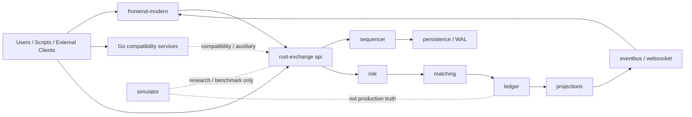
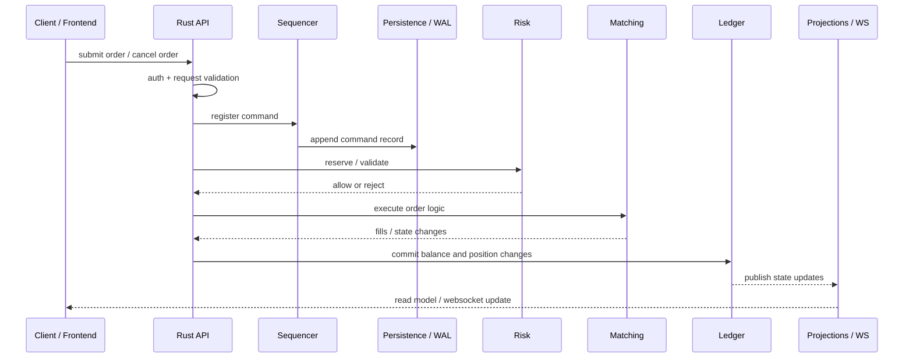
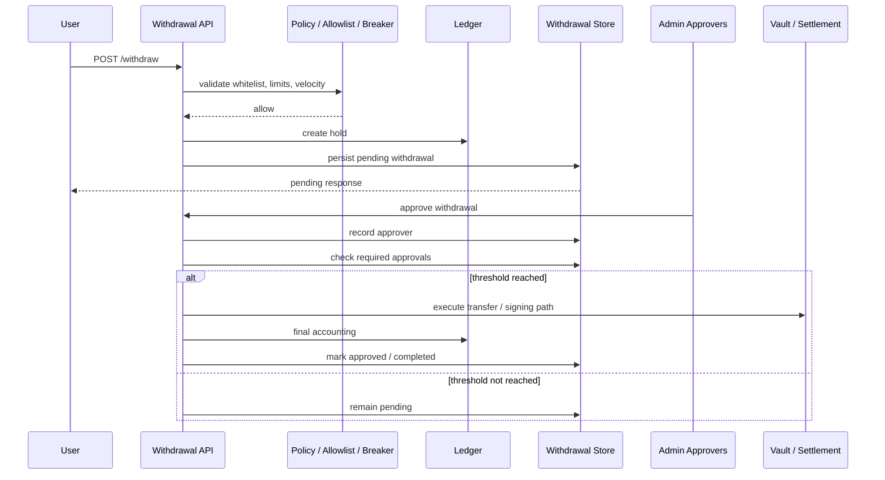

# 当前仓库真实架构说明

更新时间：2026-03-23
适用仓库：`d:\pre_trading`

## 1. 文档目的

本文档用于对齐当前仓库的真实技术架构，作为团队内部共享、交接、评审和后续演进讨论的统一口径。

本文档强调的是“当前代码真实如何运行”，而不是历史 README、原型目录或早期设计设想。

当以下材料出现冲突时，应按优先级理解：

1. 当前保留且可验证通过的代码
2. 本文档
3. `rust-exchange` 目录下的最新运行说明
4. 历史 README、旧报告、原型说明

## 2. 执行摘要

当前仓库已经从“多方向并存”收敛为一条明确主线：

- `rust-exchange` 是交易主系统，也是交易真相源
- `frontend-modern` 是当前唯一保留的主前端
- Go 目录中的 `api`、`price-service`、`hft-stream` 是兼容层和辅助服务
- `simulator` 是研究、仿真、benchmark 与论文实验区域

一句话概括当前主链路：

`frontend-modern / external clients -> rust-exchange api -> sequencer / persistence -> risk -> matching -> ledger -> projections / websocket`

## 3. 架构原则

当前仓库的真实架构，体现出以下工程原则：

### 3.1 单一交易真相源

订单、成交、资金、风险、恢复结果，最终都应以 Rust 主系统为准，而不是以前端缓存、Go 兼容服务或实验代码为准。

### 3.2 写路径集中，读路径可投影

交易写操作应集中进入 Rust API，再进入顺序化、风控、撮合和账本链路；对外展示和查询可以通过投影、聚合状态和广播层完成。

### 3.3 状态变更可追溯

顺序化、WAL、持久化和账本落账是当前主线的一部分，说明系统在设计上追求可恢复、可审计、可回放。

### 3.4 前端不拥有交易真相

前端负责交互和展示，不负责定义真实交易结果。当前已修正“后端失败但前端显示成功”的危险行为，说明这一原则已经落实到代码。

### 3.5 兼容层与主系统分离

Go 服务仍然保留，但其角色是兼容和辅助，不再承担核心交易职责。

## 4. 仓库分层结论

### 4.1 顶层系统视角

| 层 | 角色 | 当前实现 | 是否主线 |
|---|---|---|---|
| 用户界面层 | 页面、交互、操作台 | `frontend-modern` | 是 |
| 接入与控制层 | HTTP、WS、鉴权、管理、业务入口 | `rust-exchange/crates/api` | 是 |
| 交易域核心层 | 风控、撮合、账本、顺序化、恢复 | `rust-exchange/crates/*` | 是 |
| 投影与广播层 | 读模型、事件传播、状态推送 | `projections`、`eventbus`、`websocket` | 是 |
| 兼容与辅助层 | 兼容接口、旁路服务 | `api`、`price-service`、`hft-stream` | 否 |
| 研究与实验层 | 仿真、机制实验、benchmark | `simulator` | 否 |

### 4.2 重要结论

- 主系统是 Rust，不是 Go/Rust 双核心
- 主前端是 `frontend-modern`
- 兼容服务不能反向定义系统真相
- `simulator` 很重要，但其重要性属于研究和评估，不属于生产状态拥有权

## 5. 仓库结构说明

### 5.1 顶层目录定位

| 目录 | 当前定位 | 说明 |
|---|---|---|
| `rust-exchange` | 交易主系统 | 当前最完整、最可信、工程化程度最高的主线 |
| `frontend-modern` | 主前端 | 当前唯一保留并接入的正式前端 |
| `api` | Go 兼容接口 | 保留且可测试，但不再是交易核心 |
| `price-service` | Go 辅助服务 | 用于价格相关能力 |
| `hft-stream` | Go 辅助流服务 | 用于流式或旁路能力 |
| `simulator` | 仿真与 benchmark | 面向研究、实验和论文型验证 |

### 5.2 Rust 工作区结构

`rust-exchange` 当前由 10 个 crate 组成：

| crate | 职责 |
|---|---|
| `types` | 公共类型、命令、领域对象 |
| `instruments` | 品种与合约注册 |
| `projections` | 状态投影与读模型 |
| `eventbus` | 事件传播 |
| `persistence` | WAL 与持久化抽象 |
| `sequencer` | 顺序化与命令记录 |
| `ledger` | 账本与余额变更 |
| `risk` | 风控、清算、风险自动化 |
| `matching` | 撮合引擎 |
| `api` | 对外 HTTP / WebSocket 接入层 |

这 10 个 crate 组成了当前真实的交易运行时骨架。

## 6. 专业分层架构

### 6.1 表现层

表现层由 `frontend-modern` 组成，负责：

- 登录和访问控制入口
- 页面路由和导航
- 交易终端 UI
- 情报与系统页面
- 管理操作页面

当前主路由包括：

- `/login`
- `/home`
- `/trading`
- `/intel`
- `/system`
- `/admin`

对应入口：

- [App.tsx](d:/pre_trading/frontend-modern/src/App.tsx)

### 6.2 接入层

接入层主要由 Rust API crate 负责，承担：

- HTTP 路由组织
- WebSocket 接入
- principal 与角色解析
- 管理接口编排
- 观测、治理、提现、风控相关业务入口
- 启动时恢复和运行时配置加载

它不是简单的 controller 集合，而是系统对外控制面。

关键位置：

- [main.rs](d:/pre_trading/rust-exchange/crates/api/src/main.rs)

### 6.3 应用编排层

应用编排层主要位于 Rust API 与相关模块之间，负责把具体业务流程串起来，包括：

- 请求鉴权
- 参数规范化
- 业务前置校验
- 调用风控和撮合能力
- 调用治理、提现、清算等业务流程
- 组织返回结果和错误语义

这层在代码中表现为 `api/src/*.rs` 中的大量业务模块，而不是单独命名的 `application` 目录。

### 6.4 领域核心层

领域核心层是当前仓库最重要的部分，主要包括：

- `risk`
- `matching`
- `ledger`
- `sequencer`
- `persistence`
- `types`

其中：

- `risk` 决定风险约束和自动化策略
- `matching` 决定订单如何成交
- `ledger` 决定资金和结果如何落账
- `sequencer` 和 `persistence` 决定状态变更如何被顺序化、持久化和恢复

### 6.5 读模型与分发层

这层负责把核心状态转换成可读、可订阅、可展示的形式，包括：

- `projections`
- `eventbus`
- API 中的 `websocket`

它的职责是输出状态，而不是定义状态。

### 6.6 兼容与辅助层

当前保留的 Go 代码属于这一层：

- [main.go](d:/pre_trading/api/main.go)
- [main.go](d:/pre_trading/price-service/main.go)
- [main.go](d:/pre_trading/hft-stream/main.go)

它们当前仍可运行、可测试，但不拥有交易真相。

### 6.7 仿真与实验层

`simulator` 是研究和 benchmark 层，主要承担：

- 市场机制仿真
- benchmark 生成
- 策略实验
- 论文评估支持

关键入口：

- [README.md](d:/pre_trading/simulator/README.md)
- [run_neurips_benchmark_suite.ps1](d:/pre_trading/scripts/run_neurips_benchmark_suite.ps1)

## 7. 总体架构图

这张图体现的重点是：

- 所有真实交易结果最终应汇聚到 Rust 主系统
- Go 服务与 simulator 都不属于交易真相源
- 前端依赖广播和读模型获取状态

## 8. 核心运行时拓扑

### 8.1 交易主链路

当前真实交易写路径如下：

1. 用户或脚本发起请求
2. 请求进入 Rust API
3. API 完成鉴权、参数校验和业务前置检查
4. 请求进入顺序化与持久化链路
5. 风控做约束校验
6. 撮合引擎执行订单逻辑
7. 账本记录余额、持仓和结果
8. 投影层和广播层生成对外可见状态

### 8.2 主写路径时序图

### 8.3 主读路径

当前系统的读路径以“核心状态经过投影后向外暴露”为主，典型流程是：

1. 前端或调用方发起查询
2. Rust API 聚合并读取状态
3. 返回页面展示或通过 WebSocket 广播增量更新

这意味着：

- 前端不是状态真相源
- 页面展示是 Rust 状态的读取结果

## 9. 提现治理架构

提现是当前主系统中已经具备独立运行口径的重要子系统，其当前真实实现包括：

- 白名单检查
- 用户额度与地址额度检查
- breaker / velocity 检查
- ledger hold
- `pending` 记录
- 审批链
- 最终执行与记账

关键位置：

- [withdrawals.rs](d:/pre_trading/rust-exchange/crates/api/src/withdrawals.rs)

### 9.1 提现审批时序图

### 9.2 当前提现运行边界

当前提现能力的现实边界应明确写入共享口径：

- 当前资产口径收敛为 `USDC`
- 审批是累计式，而不是单管理员直接放行
- 额度和 velocity 统计在最终执行时记账
- 治理升级提现不会在入口直接 `403`

这说明提现已经不是演示接口，而是当前主系统中的正式流程。

## 10. 模块职责与权威边界

为避免后续协作时再次出现“谁说了算”的混乱，建议统一按下表理解：

| 主题 | 权威模块 |
|---|---|
| 交易真相 | `rust-exchange` |
| 订单处理 | `rust-exchange/crates/matching` |
| 风控约束 | `rust-exchange/crates/risk` |
| 资金和账本 | `rust-exchange/crates/ledger` |
| 提现治理 | `rust-exchange/crates/api/src/withdrawals.rs` |
| 页面与交互 | `frontend-modern` |
| 兼容接口 | Go 目录 |
| benchmark / 仿真 | `simulator` |

进一步解释就是：

- 业务结果以 Rust 为准
- 页面体验以前端为准
- 兼容与实验代码不能反向定义主系统架构

## 11. 工程与交付架构

当前 Rust 主线不仅承担业务主线，也承担工程交付主线，包括：

- CI 工作流
- Release 工作流
- Dockerfile
- docker-compose
- 配置文件
- 启动与校验脚本

关键文件包括：

- [.github/workflows/rust-ci.yml](d:/pre_trading/.github/workflows/rust-ci.yml)
- [.github/workflows/rust-release.yml](d:/pre_trading/.github/workflows/rust-release.yml)
- [Dockerfile](d:/pre_trading/rust-exchange/Dockerfile)
- [docker-compose.yml](d:/pre_trading/rust-exchange/docker-compose.yml)
- [exchange.toml](d:/pre_trading/rust-exchange/config/exchange.toml)
- [start_complete_system.ps1](d:/pre_trading/start_complete_system.ps1)
- [verify_system.ps1](d:/pre_trading/verify_system.ps1)

前端当前具备基础质量门：

- `npm run build`
- `npm run lint`

Go 侧当前主要通过：

- `go test ./...`

完成可用性验证。

## 12. 关键入口与代表性文件

### 12.1 前端入口

- [App.tsx](d:/pre_trading/frontend-modern/src/App.tsx)
- [exchangeAPI.ts](d:/pre_trading/frontend-modern/src/services/exchangeAPI.ts)

### 12.2 Rust 主入口

- [main.rs](d:/pre_trading/rust-exchange/crates/api/src/main.rs)

### 12.3 领域核心文件

- [lib.rs](d:/pre_trading/rust-exchange/crates/risk/src/lib.rs)
- [partitioned.rs](d:/pre_trading/rust-exchange/crates/matching/src/partitioned.rs)
- [lib.rs](d:/pre_trading/rust-exchange/crates/ledger/src/lib.rs)
- [lib.rs](d:/pre_trading/rust-exchange/crates/persistence/src/lib.rs)
- [withdrawals.rs](d:/pre_trading/rust-exchange/crates/api/src/withdrawals.rs)

### 12.4 兼容服务入口

- [main.go](d:/pre_trading/api/main.go)
- [main.go](d:/pre_trading/price-service/main.go)
- [main.go](d:/pre_trading/hft-stream/main.go)

### 12.5 研究与 benchmark 入口

- [README.md](d:/pre_trading/simulator/README.md)
- [run_neurips_benchmark_suite.ps1](d:/pre_trading/scripts/run_neurips_benchmark_suite.ps1)

## 13. 当前验证状态

截至本文档更新时间，当前保留主线已经通过以下本地验证：

- Rust：`cargo check --workspace --all-targets`
- Rust：`cargo test -q`
- Rust：`cargo clippy --workspace --all-targets -- -D warnings`
- Frontend：`npm run build`
- Frontend：`npm run lint`
- Go：`go test ./...`

因此，本文档描述的是“当前本地可验证通过的运行架构”，而不是只存在于文档中的理想结构。

## 13.1 关键动作 Owner 核验表

下表只记录当前本地真实代码下，关键写动作的唯一入口、必经模块、审批要求、不可绕过点和当前状态判定。

| 动作 | 唯一入口 | 必经模块 | 审批要求 | 不可绕过点 | 验证状态 |
|---|---|---|---|---|---|
| 下单 | `/submit-order` | `auth -> sequencer -> risk -> matching -> ledger` | 无 | `risk / matching / ledger` | 已测通过 |
| 撤单 | `/cancel-order` | `auth -> ownership -> sequencer -> matching` | 无 | `ownership` | 已测通过 |
| 提现 | `/withdraw` | `auth -> policy -> hold -> pending -> approval -> execute` | 多签 | `approval threshold` | 已修复 |
| kill switch | `governance action` | `auth -> create action -> approve -> execute` | 双签 | `direct execute forbidden` | 已测通过 |
| rollback | `rollback api` | `auth -> checkpoint -> verify -> execute` | 高权 | `no direct rollback` | 存在风险 |

状态判定说明：

- `已测通过`：代码路径存在明确强制点，且仓库内已有测试可支撑。
- `已修复`：此前发现过实际缺口，本轮已修正到当前代码口径。
- `存在风险`：当前实现与目标运行口径仍有差距，或根本不存在完整执行链。

### 13.2 Owner 级别结论

#### 提现是否能绕审批直接执行

当前公开 API 下，未发现可绕过审批直接执行的提现路径。

原因：

- `/withdraw` 只会创建 `pending` 记录和 `ledger hold`
- `/admin/withdrawal/approve` 会检查当前状态是否为 `pending`
- 同一管理员不能重复审批
- 达到 `required_approvals` 之前只会继续保持 `pending`
- 只有审批阈值满足后，才进入最终转账与记账

当前结论：`已修复`

#### 高危治理动作是否能绕 action queue

以 `kill switch` 和 `set_market_state` 为代表的高危治理动作，当前公开入口都先创建 governance action，再进入批准流程，未发现公开 API 的直接执行入口。

但这里有一个必须写明的边界：

- 当前 `rollback` 并不是“可执行回滚 API”
- 现有 `rollback` 模块只提供 `status / cleanup / runbook / backup`
- 也就是说，仓库里并不存在你表格中那种 `auth -> checkpoint -> verify -> execute` 的真实回滚执行链

当前结论：

- `kill switch`：`已测通过`
- `rollback`：`存在风险`

#### 是否存在绕过 risk 的下单路径

当前公开下单路径未发现绕过 `risk` 的入口。

原因：

- `submit-order` 路由进入 `engine.submit_new_order`
- `matching` 内部会先执行 `validate_order_acceptance(...)`
- 随后执行 `reserve_order_reservation(...)`
- 资金或仓位预留通过 `risk.reserve_buy / reserve_sell / reserve_margin` 完成
- 成交后再进入结算与账本

补充说明：

- 内部触发型路径如 stop order 激活，最终也还是回到 `engine.submit_new_order`
- 当前未发现对外暴露的“直进 matching、不经 risk”的写入口

当前结论：`已测通过`

#### 是否存在绕过 ledger 的余额修改

当前未发现公开 API 里绕过 `ledger` 的余额修改路径。

原因：

- 用户转账通过 `ledger.transfer_cash(...)`
- 提现通过 `create_cash_hold / release_cash_hold / transfer_cash_between_accounts`
- 成交结算通过 `risk.settle_trade / settle_derivative_trade`，最终落到 `ledger`
- 直接充值也调用 `ledger.process_deposit(...)`

但这里还有一个 owner 视角下需要额外强调的点：

- 有少量高权限资金或参数操作是“直接调用 ledger / risk”，而不是走 governance queue
- 例如 `/deposit` 是管理员直接入账接口
- 这不属于“绕过 ledger”
- 但属于“没有经过更高层治理审批的高权限写操作”

当前结论：

- “绕过 ledger 的余额修改”：`已测通过`
- “高权限余额写操作是否都进治理队列”：`存在风险`

## 14. 与旧口径的主要差异

当前真实架构与旧口径的差异主要体现在：

- 交易核心已经明确收敛到 Rust
- 前端主线已经明确收敛到 `frontend-modern`
- 旧前端壳子和杂乱原型已不再属于主线
- Go 服务是兼容与辅助层，不再是核心交易实现
- 工程门禁和交付主线也更明显地集中在 Rust 侧

这部分差异非常关键，因为它直接影响：

- 需求归属
- bug 定位
- 风险判断
- 团队协作边界

## 15. 当前仍需明确的现实限制

虽然主线已经清晰，但共享文档里仍应明确以下限制：

- 仓库表面上仍存在多语言目录，容易让新成员误判为双核心
- `simulator` 规模较大，容易被误读为生产主链路的一部分
- 前端虽然已通过构建和 lint，但历史文件体量仍较大
- 某些运行细节仍需持续补写到正式文档中

因此，团队在阅读仓库时，必须先区分：

- 主系统代码
- 兼容代码
- 实验代码

## 16. 协作建议

为了保持未来的架构口径稳定，建议团队统一以下规则：

- 讨论交易、风控、账本、恢复、提现治理时，以 Rust 主系统为准
- 讨论交互、页面和操作台时，以 `frontend-modern` 为准
- 讨论兼容入口时，可以参考 Go 服务，但不能以 Go 的中间状态作为交易真相
- 讨论研究实验、benchmark 和论文结果时，以 `simulator` 为准，但不能直接映射为生产链路

## 17. 结论

从当前本地真实代码看，仓库已经形成了清晰的专业化分工：

- Rust 承担交易核心与工程交付
- 前端承担界面与操作体验
- Go 承担兼容与辅助职责
- simulator 承担研究与 benchmark 职责

因此，后续所有技术共享、模块分工、缺陷审计、需求设计和架构演进讨论，都建议以本文档与 `rust-exchange` 当前实现作为第一口径。
