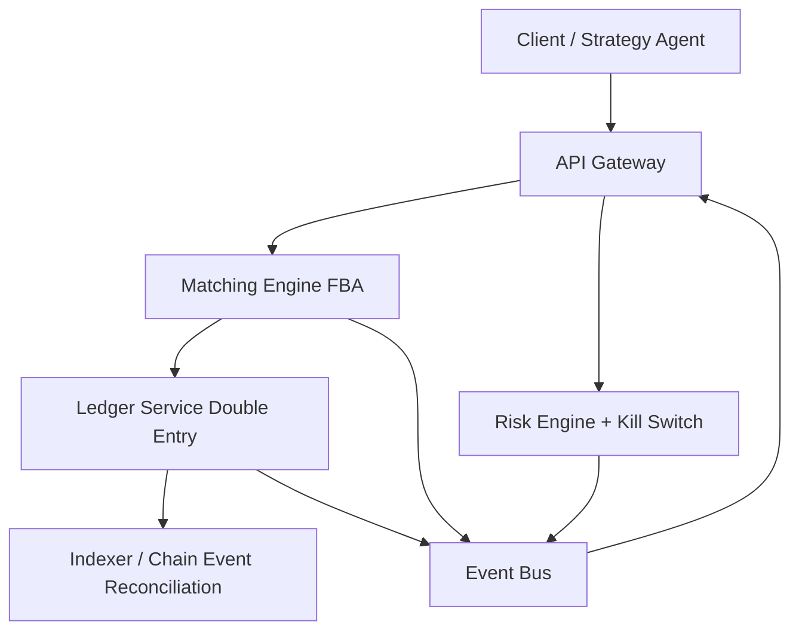

# Ledger-First Market Infrastructure with Frequent Batch Auction Matching

Go-based modular exchange/prediction market systems prototype.

Frequent Batch Auction (FBA) matching, double-entry ledger settlement, risk controls, and event-driven state propagation.

## System Metrics (Synthetic Workload)

Source artifact: `docs/benchmarks/matching_system_profile.json`  
Workload: 200 buy/sell pairs in one market/outcome per scenario.

| Batch Window | Orders/s | Fills/s | p50 Latency | p99 Latency |
|---|---:|---:|---:|---:|
| 100ms | 4958.8 | 4958.8 | 80.66ms | 80.66ms |
| 500ms | 832.8 | 832.8 | 480.29ms | 480.29ms |
| 1000ms | 407.4 | 407.4 | 981.85ms | 981.85ms |

Interpretation:
- tighter batch windows improve latency but increase matching cadence and system churn;
- wider windows smooth cadence but raise tail latency (p99).

## Architecture



Core services:
- API Gateway (`api/`)
- Matching Engine (`matching/`)
- Ledger Service (`ledger/`)
- Risk Service (`risk/`)
- Indexer (`indexer/`)
- Shared Event + Type layer (`services/`)

## Correctness Guarantees

The project treats correctness as explicit invariants, not implicit assumptions.

1. `No negative user/market balances`
- ledger rejects deltas that would make non-system accounts negative.

2. `Conservation of funds`
- internal ledger transfer preserves total balance across accounts.

3. `Replay is idempotent`
- duplicate `op_id` is rejected; replay cannot mutate balances.

4. `Partial fills preserve consistency`
- buy/sell fill totals are balanced at clearing; no fill exceeds order size.

5. `Deterministic matching semantics`
- deterministic clearing-price tie-break and deterministic pro-rata remainder allocation.

6. `Risk transitions follow FSM gating`
- market state + kill-switch levels enforce monotonic permission restrictions.

Invariant tests:
- `matching/main_test.go`
- `ledger/main_test.go`
- `risk/main_test.go`
- `matching/profile_test.go` (benchmark profile generation)

## Repository Layout

```text
fund/
├─ api/
├─ ledger/
├─ matching/
├─ risk/
├─ indexer/
├─ services/
├─ benchmark/
├─ docs/
│  └─ benchmarks/
├─ frontend-modern/
├─ .github/workflows/
└─ start.ps1
```

## Onboarding

### Prerequisites
- Go 1.21+
- Node 20+ (for `frontend-modern` quality/benchmark tasks)

### Setup

```powershell
git clone https://github.com/BigMmoney/fund.git
cd fund
go mod tidy
```

### Start Services

```powershell
.\start.ps1
```

### Run Core Invariants

```powershell
go test ./matching ./ledger ./risk -v
```

### Run Frontend Invariants + Benchmark

```powershell
cd frontend-modern
npm install
npm run ci:quality
```

### Generate System Batch-Window Profile

```powershell
cd ..
$env:RUN_SYSTEM_BENCH="1"
go test ./matching -run TestGenerateMatchingSystemProfile -v
```

## CI / Workflow Matrix

1. `system-invariants.yml`
- core service invariants (`matching`, `ledger`, `risk`)

2. `ci.yml`
- Go lint + test baseline and frontend invariant tests

3. `bench.yml`
- generates system + frontend benchmark artifacts

4. `release.yml`
- tag-driven GitHub release pipeline

## Research / Paper Track

Paper blueprint and writing plan:
- `docs/PAPER_BLUEPRINT.md`

Suggested framing:
- systems + market infrastructure (not product UI)
- deterministic settlement and replay safety
- fairness/latency tradeoff under FBA windows

## License

Project license to be finalized.
