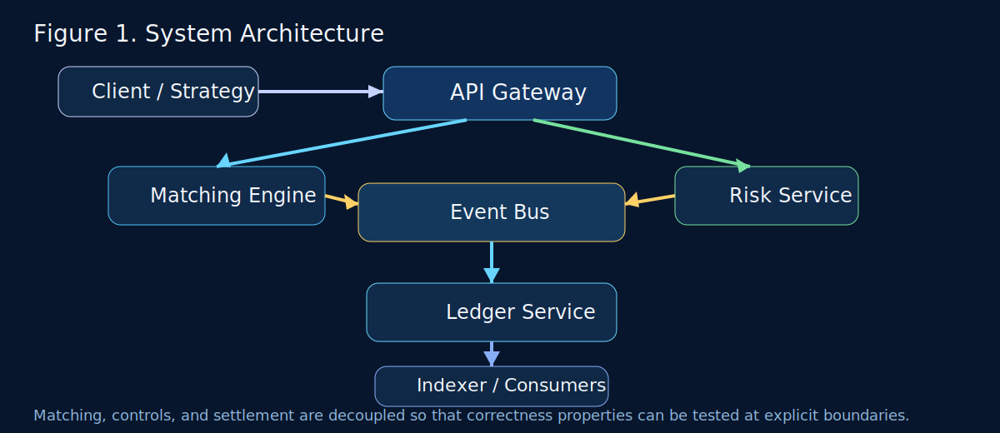
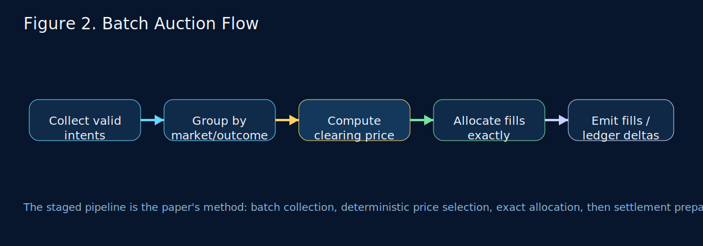
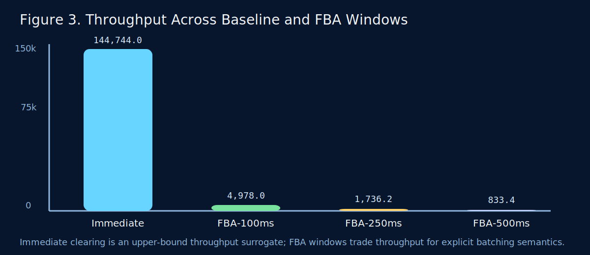
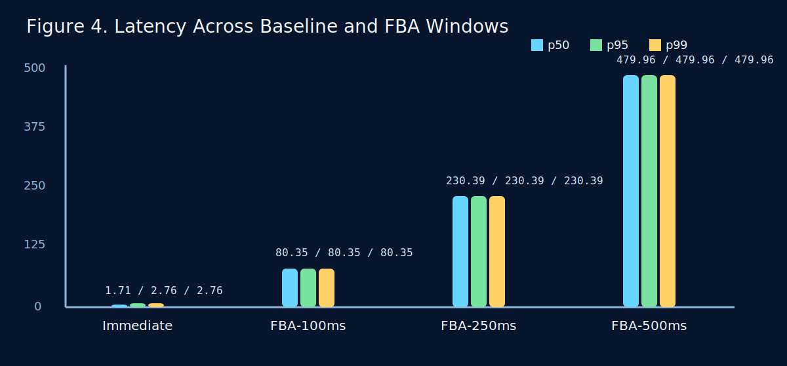
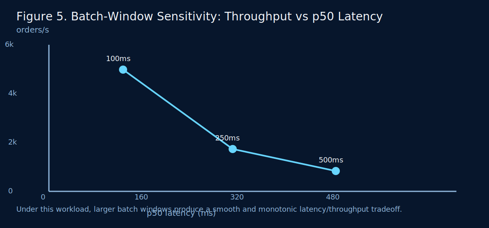

# Design and Evaluation of a Ledger-First Frequent Batch Auction Market System

## Abstract

Continuous limit order book matching offers low response time, but it also concentrates economic advantage in microscopic arrival-time differences and complicates post-trade reasoning under retries and partial fills. This paper studies a different systems design point: a ledger-first market infrastructure prototype that combines frequent batch auction (FBA) matching with explicit double-entry settlement and executable risk controls. The central research question is whether a short-window FBA architecture can preserve useful throughput while making settlement semantics deterministic and replay-safe. We implement a modular prototype composed of a matching engine, ledger service, risk service, and event-driven integration layer. We then evaluate the system under a synthetic workload using an immediate-clearing surrogate baseline and FBA windows of 100 ms, 250 ms, and 500 ms. Under a 200 buy/sell-pair single-market workload, the immediate surrogate reaches 144,744.0 orders/s with 1.71 ms p50 latency, while FBA-100 ms reaches 4,978.0 orders/s with 80.35 ms p50 latency and FBA-500 ms reaches 833.4 orders/s with 479.96 ms p50 latency. Beyond throughput and latency, the system encodes correctness as executable invariants covering matched-volume conservation, non-negative balances, replay idempotency, and monotonic risk restrictions. The result is a research-oriented artifact that exposes the engineering tradeoff between batching and responsiveness while demonstrating deterministic settlement behavior.

**Keywords:** market infrastructure, frequent batch auction, double-entry ledger, deterministic matching, replay safety, risk controls

## 1. Introduction

Electronic markets are not defined only by financial instruments or user interfaces. They are defined by system semantics: how orders are grouped, how prices are determined, how fills are settled, and how failures or retries affect state. In continuous matching systems, the smallest timing edge can influence execution priority. That property enables highly responsive markets, but it also creates fairness concerns and an operational bias toward ever-faster processing.

Frequent batch auctions (FBA) provide a different design point. Rather than clearing each order immediately, the market aggregates intents over a short batch window and computes a single clearing price for the batch. The policy motivation is well known: when competition happens over price within discrete windows, microscopic arrival-time advantages matter less. The systems implication is equally important: batching turns matching into an explicitly staged computation that is easier to reason about, test, and replay.

This paper is motivated by a second observation: matching alone is not enough. A market system also needs explicit settlement semantics. If fills are produced but ledger mutation is nondeterministic, duplicate, or sensitive to malformed state transitions, the system remains unsafe regardless of how elegant the matching mechanism is. For that reason, this repository adopts a ledger-first architecture in which all financial state changes flow through explicit double-entry deltas guarded by replay checks and balance validation.

### 1.1 Research Question

The central question of this paper is:

> **RQ:** Can a ledger-first frequent batch auction architecture preserve useful throughput under short batch windows while providing deterministic settlement semantics and executable correctness guarantees relative to an immediate-clearing surrogate?

This is intentionally narrower than asking whether the system "solves fairness." The current artifact does not implement a full market simulator or empirical fairness metric. Instead, it answers a systems question that the repository can support rigorously:

1. what throughput and latency cost is paid when moving from immediate clearing to 100--500 ms FBA windows;
2. whether the resulting state transitions remain deterministic and replay-safe;
3. whether correctness properties can be encoded as executable invariants rather than informal design claims.

### 1.2 Contributions

This paper makes four concrete contributions:

1. It presents a modular market infrastructure prototype centered on ledger-first settlement and FBA matching.
2. It defines a deterministic batch-clearing procedure with explicit tie-break and exact largest-remainder allocation.
3. It formalizes key correctness properties as invariants and maps each invariant to executable tests in the repository.
4. It evaluates the system using both an immediate-clearing surrogate baseline and multiple batch-window settings, exposing the throughput/latency tradeoff introduced by FBA.

## 2. Background and Problem Setting

### 2.1 Continuous Matching and Temporal Advantage

In a continuous limit order book, orders are processed serially as they arrive. This makes throughput and latency visible product features, but it also makes minute time differences economically meaningful. Budish, Cramton, and Shim argue that this dynamic produces an arms race for speed and motivates alternative market designs such as frequent batch auctions [1].

For a systems artifact, the value of FBA is not only conceptual fairness. It is also architectural structure. A batch turns a stream of orders into an explicit unit of computation that can be observed, replayed, and validated before settlement.

### 2.2 Ledger-First Settlement

Market systems often fail in post-trade logic rather than in the price-discovery step itself. Retries, duplicate events, or partially applied state changes can break balances even if matching logic is correct. A ledger-first architecture treats financial mutation as the fundamental state transition and requires every mutation to pass through explicit validation, replay filtering, and atomic application.

In this repository, the ledger is intentionally compact: accounts are held in memory, every delta carries an `op_id`, committed deltas are appended to a write-ahead log slice, and non-system accounts cannot go negative. This is not a production persistence model, but it is an effective correctness surface for research and systems evaluation.

### 2.3 Research Scope

The repository does not implement a production exchange. There is no distributed log, no durable write-ahead log replay after process crash, and no statistical fairness study over realistic market flow. The scope is narrower and more defensible: build a compact market infrastructure artifact whose matching, settlement, and risk semantics are explicit enough to evaluate.

## 3. System Architecture

### 3.1 Components

The system is organized around six components:

- `api/`: request ingestion and orchestration
- `matching/`: FBA matching engine
- `ledger/`: double-entry settlement service
- `risk/`: market-state and kill-switch controls
- `indexer/`: downstream reconciliation hooks
- `services/`: shared event bus, type definitions, and utilities

The design goal is separation of concerns. Matching determines the economic outcome of a batch. Ledger determines whether the resulting state transition is valid. Risk determines whether the system should permit or block classes of actions. The event bus connects these decisions without tightly coupling components.

### 3.2 Architecture Figure



**Figure 1.** The architecture separates intent ingestion, batch matching, ledger mutation, and risk gating. This separation is critical to the paper's argument: deterministic matching is useful only if settlement and controls remain explicit and independently testable.

### 3.3 Execution Path

At a high level, the processing path is:

1. a client or strategy submits an intent through the API layer;
2. the matching engine groups intents by `(market_id, outcome)` within a batch window;
3. the engine computes a clearing price and generates fills;
4. downstream logic turns fills into ledger deltas;
5. the ledger validates and commits the deltas;
6. the risk and indexing layers observe the resulting events.

This path is deliberately one-directional. Matching does not directly mutate balances. Ledger does not decide clearing prices. Risk does not allocate fills. The decomposition makes it possible to evaluate correctness at clear interfaces.

## 4. Matching Algorithm

### 4.1 Batch Auction Clearing

The matching engine processes intents on a periodic ticker. At each batch boundary, it filters cancelled, expired, and already filled intents; groups valid intents by market/outcome; aggregates buy and sell books; computes a clearing price; and allocates fills proportionally among eligible participants.

### 4.2 Algorithm 1

The matching method can be stated explicitly as follows.

```text
Algorithm 1: Batch Auction Clearing and Settlement Preparation
Input: intents arriving during batch window W
Output: fill set F for each (market, outcome) bucket

1. Collect intents whose status is pending and not expired.
2. Partition intents by (market_id, outcome).
3. For each partition G:
4.     Build cumulative demand and supply curves over observed price points.
5.     For each candidate price p:
6.         volume(p) = min(demand(p), supply(p)).
7.     Select clearing price p* that maximizes volume(p).
8.     Break ties deterministically by choosing the lowest p.
9.     Filter buys with price >= p* and sells with price <= p*.
10.    Let V be min(total eligible buy amount, total eligible sell amount).
11.    Allocate V on each side using proportional base allocation.
12.    Distribute leftover units by largest remainder with stable tie-breaks.
13.    Emit fills F and hand off downstream for ledger delta construction.
14. Return union of all fills.
```

This pseudo-code matters because it reframes the repository from "a working service" to "a specific method under evaluation." The matching implementation is no longer just a code path; it is the object of study.

### 4.3 Deterministic Clearing Price

For each market/outcome partition, the engine evaluates all observed price points and computes matched volume as:

\[
V(p) = \min(D(p), S(p))
\]

where \(D(p)\) is cumulative demand from buys willing to trade at or above \(p\), and \(S(p)\) is cumulative supply from sells willing to trade at or below \(p\). The clearing price is the price \(p^*\) that maximizes \(V(p)\). When several prices produce equal matched volume, the engine chooses the lowest such price.

This tie-break is intentionally simple. The paper does not claim it is the only reasonable policy. It claims something narrower and more valuable for this artifact: the policy is deterministic, explicit, and testable.

### 4.4 Exact Pro-Rata Allocation

After selecting the clearing price, the engine computes eligible demand and supply and sets total matched volume to:

\[
V = \min \left(\sum_i b_i,\ \sum_j s_j \right)
\]

Naive floor-only pro-rata assignment can under-allocate volume because integer division discards remainder. To avoid that drift, the engine:

1. computes a base proportional allocation,
2. records the remainder for each order,
3. allocates remaining units using largest remainder,
4. breaks equal-remainder ties by larger order amount and then order ID.

This ensures exact matched-volume conservation while keeping each fill bounded by the originating order size.

### 4.5 Batch Flow Figure



**Figure 2.** The batch pipeline makes computation stages explicit. That explicit staging is what allows the system to attach correctness checks and deterministic semantics to each phase.

## 5. Correctness Model and System Invariants

This section is the strongest part of the artifact. The repository does not merely claim correctness properties; it encodes them as tests.

### 5.1 Invariant 1: Matched-Volume Conservation

For any cleared batch \(B\),

\[
\sum_{f \in F_{\text{buy}}(B)} \text{amount}(f)
=
\sum_{f \in F_{\text{sell}}(B)} \text{amount}(f)
\]

and each fill amount is bounded by the source order amount.

This invariant is enforced by the allocation logic and tested in `matching/main_test.go`.

### 5.2 Invariant 2: No Negative Non-System Balances

For every committed ledger delta and every non-system account \(a\),

\[
\text{balance}_{t+1}(a) \ge 0
\]

System-prefixed accounts (`SYS:*`) are treated as externally funded sources or sinks for modeling deposits and other external flows. This exception is explicit and local rather than implicit and accidental.

### 5.3 Invariant 3: Conservation of Funds

For any valid internal ledger delta \(\Delta\),

\[
\sum_a \text{balance}_{t+1}(a)

=
\sum_a \text{balance}_{t}(a)
\]

That is, internal transfer semantics preserve total balance across accounts. This invariant is tested directly in `ledger/main_test.go`.

### 5.4 Invariant 4: Deterministic Replay / Idempotency

If a ledger delta with operation ID `op_id` has already been committed, replaying the same `op_id` must not mutate balances, versions, or total funds. Formally, if `seen(op_id)` is true, then:

\[
\text{state}_{t+1} = \text{state}_t
\]

for any replay attempt carrying that same ID.

This invariant is fundamental to any event-driven settlement system. It is also one of the clearest boundaries between a demo and a serious systems artifact.

### 5.5 Invariant 5: Monotonic Risk Restrictions

Let kill-switch levels be ordered by severity \(L1 < L2 < L3 < L4\). If an operation class is blocked at level \(L_k\), it must remain blocked for every more restrictive level \(L_m\) where \(m > k\). In the implementation:

- `L1` blocks new trading
- `L2` additionally blocks withdrawals
- `L3` additionally blocks chain signing
- `L4` enforces read-only mode

This is tested in `risk/main_test.go`.

### 5.6 Test Mapping

The invariants above are not informal claims. They are covered by executable tests:

- `matching/main_test.go`
- `ledger/main_test.go`
- `risk/main_test.go`

The project therefore supports a stronger statement than "the system appears correct under manual use." It supports the statement that specific semantic properties are continuously regression-tested.

## 6. Experimental Methodology

### 6.1 Evaluation Goals

The evaluation is organized around three practical questions:

1. **RQ1:** What throughput and latency does the system achieve under short FBA windows?
2. **RQ2:** How does FBA compare to an immediate-clearing surrogate baseline?
3. **RQ3:** How sensitive is the system to batch-window size?

### 6.2 Workload

The paper uses a synthetic workload generated by `matching/profile_test.go`. Each scenario creates:

- one market and one outcome bucket,
- 200 buy/sell pairs,
- 400 orders total,
- price-compatible orders that fully clear when matched.

This workload is intentionally controlled. It is not meant to approximate real trading behavior. It is meant to isolate how the system behaves when all orders are valid, compatible, and competing within a single partition.

### 6.3 Baseline

The baseline is an **immediate-clearing surrogate**, not a full continuous order book implementation. Concretely, the benchmark inserts a compatible buy/sell pair and immediately invokes batch processing rather than waiting for a timer tick. This creates a useful lower-bound latency / upper-bound throughput reference point for the existing engine without pretending to be an industrial continuous-time exchange.

That distinction matters. The paper is careful not to claim that the baseline is a production LOB. It is a controlled comparison point for the same codebase.

### 6.4 Metrics

For each scenario, the benchmark reports:

- orders per second,
- fills per second,
- p50 latency,
- p95 latency,
- p99 latency.

The paper-specific artifact is stored in:

- `docs/benchmarks/paper_evaluation_profile.json`
- `docs/benchmarks/paper_evaluation_profile.md`
- `docs/benchmarks/paper_evaluation_profile.csv`

## 7. Experimental Results

### 7.1 Throughput and Latency Table

Table 1 reports the paper evaluation profile generated from the repository.

| Scenario | Mode | Batch Window | Orders/s | Fills/s | p50 | p95 | p99 |
|---|---|---:|---:|---:|---:|---:|---:|
| Immediate Surrogate | immediate | 0 ms | 144,744.0 | 144,744.0 | 1.71 ms | 2.76 ms | 2.76 ms |
| FBA-100ms | batch | 100 ms | 4,978.0 | 4,978.0 | 80.35 ms | 80.35 ms | 80.35 ms |
| FBA-250ms | batch | 250 ms | 1,736.2 | 1,736.2 | 230.39 ms | 230.39 ms | 230.39 ms |
| FBA-500ms | batch | 500 ms | 833.4 | 833.4 | 479.96 ms | 479.96 ms | 479.96 ms |

The immediate surrogate behaves as expected: it provides the highest throughput and lowest latency because the system clears immediately after pair insertion. FBA windows reduce both throughput and responsiveness as the wait interval grows.

### 7.2 Throughput Figure



**Figure 3.** Throughput drops sharply from the immediate surrogate to FBA windows because batching introduces deliberate waiting. This is not a defect in the measurement; it is the expected cost of the policy.

### 7.3 Latency Figure



**Figure 4.** In the current synthetic benchmark, p50/p95/p99 collapse to nearly identical values for each FBA scenario because all orders are inserted before the first batch tick and clear in a single deterministic cycle. This is an artifact of the benchmark design, not a claim that production tail latency would be flat.

### 7.4 Batch-Window Tradeoff Figure



**Figure 5.** The batch window acts as a direct systems policy knob. Moving from 100 ms to 500 ms reduces measured throughput by roughly 6x and increases p50 latency by roughly 6x. The tradeoff is smooth and monotonic under this workload.

### 7.5 Interpretation

The results support three restrained claims.

First, the system preserves useful throughput under short FBA windows. Although FBA-100 ms is far slower than immediate clearing, it still sustains 4,978.0 orders/s in the present workload.

Second, the cost of batching is explicit and monotonic. The jump from 100 ms to 250 ms to 500 ms increases latency and decreases throughput in a predictable way.

Third, the evaluation clarifies what is and is not proven. The benchmark measures the operational cost of batching. It does not directly measure fairness. Fairness remains the design motivation for FBA, but this repository currently provides a systems evaluation rather than a market-microstructure fairness study.

## 8. Discussion

### 8.1 Why This Is a Research Artifact Rather Than Only a Project

Without a research question, an algorithm, invariants, and experiments, the repository would be a project report. With those elements, the artifact becomes a paper about a method and its tradeoffs. The method under study is not "a website that shows market data." It is a ledger-first FBA architecture with deterministic clearing and replay-safe settlement.

### 8.2 Fairness Motivation, but Not Fairness Proof

The repository is inspired by the fairness motivation of FBA, but the current experiments do not quantify fairness outcomes. That distinction should remain explicit. The paper can defend batching as a mechanism that weakens microscopic time priority by design, but it should not claim measured fairness improvement until a richer simulation and metric are added.

### 8.3 Determinism as a Systems Contribution

Many prototypes focus on matching logic alone. This artifact's stronger contribution is that matching, settlement, and controls are all explicit enough to be tested as system semantics. Deterministic price selection, exact matched-volume conservation, replay idempotency, and monotonic risk restrictions together form a more compelling systems story than throughput alone.

## 9. Limitations and Future Work

The current artifact has clear limitations.

1. The evaluation is single-process and synthetic.
2. The baseline is an immediate-clearing surrogate rather than a full continuous LOB engine.
3. The write-ahead log is in-memory, so crash recovery is not yet demonstrated.
4. The benchmark uses synchronized compatible orders, which collapses tail percentiles within each batch scenario.
5. There is no direct empirical fairness metric.

These limitations define the next steps:

1. add stochastic and adversarial arrival models,
2. add a richer continuous-matching baseline,
3. persist the write-ahead log and validate restore-time invariants,
4. extend experiments to multi-market workloads,
5. add formal fairness-oriented metrics once a fuller simulator exists.

## 10. Related Work

The most direct conceptual influence is the FBA literature of Budish, Cramton, and Shim [1], which frames batch auctions as a market-design response to the high-frequency trading arms race. More recent work on flow trading broadens the design space for discrete-time market mechanisms [3].

From the systems side, event-driven log architectures such as Kafka emphasize explicit event propagation and replay as system primitives [2]. The current artifact does not implement a distributed log, but it adopts the same intuition that stateful downstream processing benefits from explicit event boundaries.

Commercial exchange infrastructure provides a practical contrast point: production matching engines are optimized for extreme scale, asset breadth, and operational resilience [4]. This paper does not compete on production readiness. It instead isolates a narrower question about determinism, replay safety, and batch-induced systems tradeoffs in a compact research artifact.

## 11. Conclusion

This paper presented a ledger-first frequent batch auction market system and evaluated it as a systems artifact rather than as a product demonstration. The core result is not that batching is universally superior. The core result is that a short-window FBA architecture can be implemented with deterministic clearing, replay-safe settlement, and explicit correctness guarantees while still sustaining meaningful throughput. Under the current workload, the system reaches 4,978.0 orders/s at 100 ms FBA and 833.4 orders/s at 500 ms, with the expected latency cost of waiting for larger batches.

The stronger contribution of the repository is methodological. It turns design claims into algorithm descriptions, invariants, and reproducible experiments. That makes it a useful foundation for future work on batch-market infrastructure, deterministic settlement systems, and correctness-driven exchange prototypes.

## References

[1] Eric Budish, Peter Cramton, and John J. Shim. "The High-Frequency Trading Arms Race: Frequent Batch Auctions as a Market Design Response." *The Quarterly Journal of Economics*, 130(4):1547-1621, 2015. DOI: 10.1093/qje/qjv027.

[2] Jay Kreps, Neha Narkhede, and Jun Rao. "Kafka: a Distributed Messaging System for Log Processing." *Proceedings of the NetDB Workshop*, 2011.

[3] Eric Budish, Peter Cramton, Albert S. Kyle, Jeongmin Lee, and David Malec. "Flow Trading." NBER Working Paper 31098, 2023. DOI: 10.3386/w31098.

[4] Nasdaq. "Exchange Matching Engine." product documentation, accessed March 6, 2026.

## Appendix A. Reproducibility

Core invariants:

```powershell
go test ./matching ./ledger ./risk -v
```

Paper evaluation profile:

```powershell
$env:RUN_SYSTEM_BENCH="1"
go test ./matching -run TestGeneratePaperEvaluationProfile -v
```

Generated artifacts:

- `docs/benchmarks/paper_evaluation_profile.json`
- `docs/benchmarks/paper_evaluation_profile.md`
- `docs/benchmarks/paper_evaluation_profile.csv`
