# Appendix Figures

This appendix collects the repository-hosted figure set that supplements the NeurIPS-track manuscript.

## Core Figures

## Parameter Cube Slices

Each slice fixes retail intensity and renders informed intensity against maker quote width.

### Retail x1

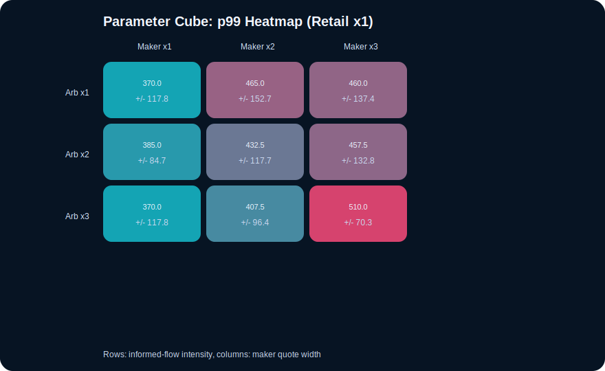

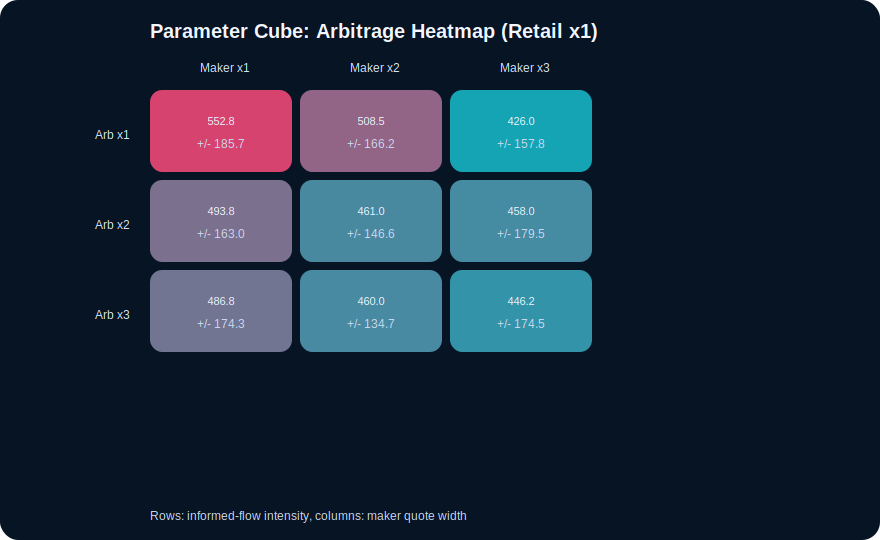

### Retail x2

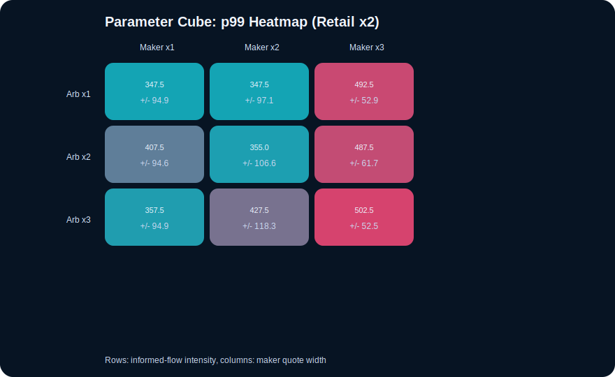

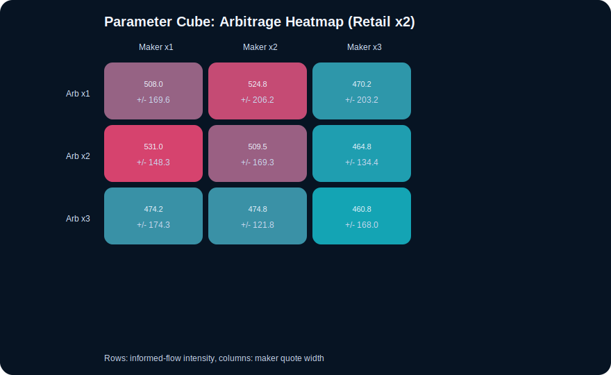

### Retail x3

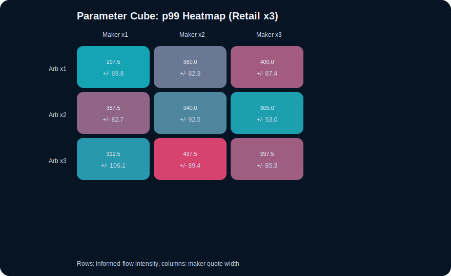

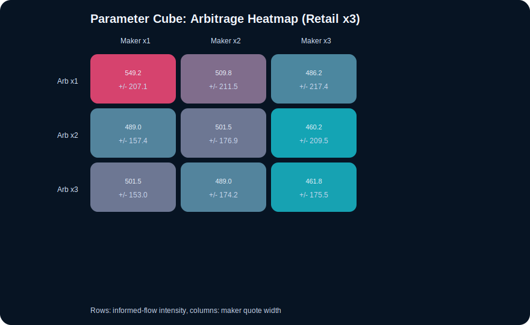

## Unified Hypercube Slices

Each hypercube slice fixes informed intensity at `x2` and renders retail intensity against maker quote width for a given arbitrage level.

### Arb x0

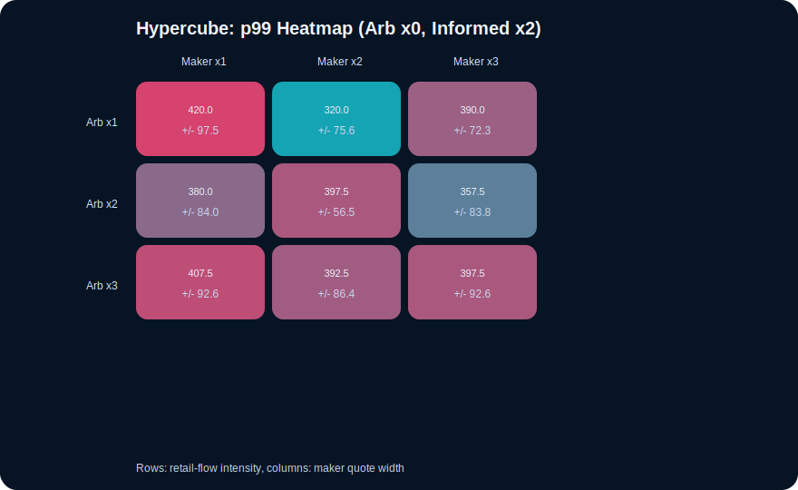

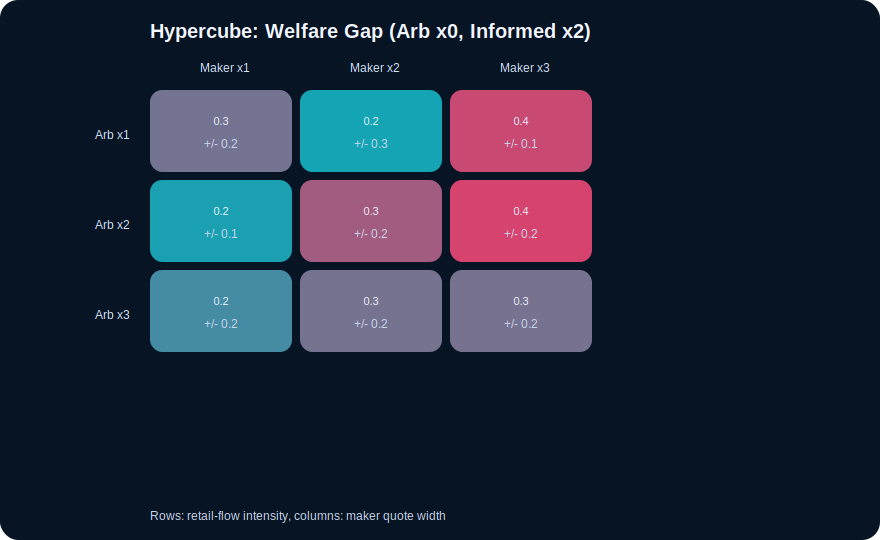

### Arb x1

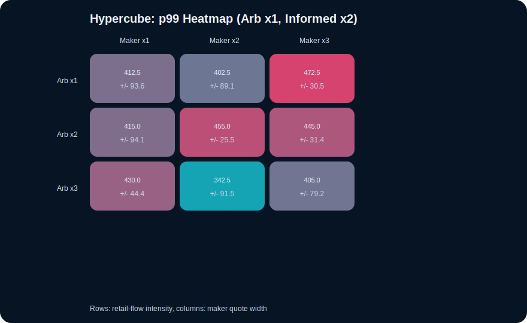

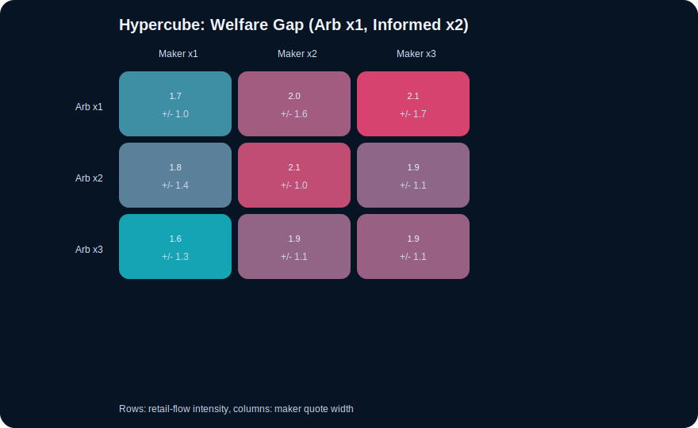

### Arb x2

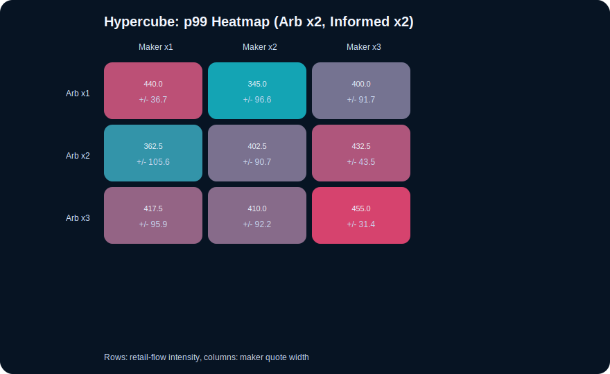

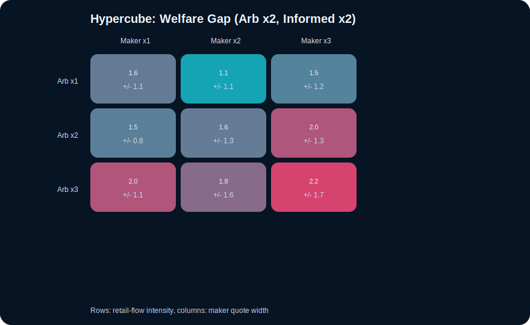

### Arb x3

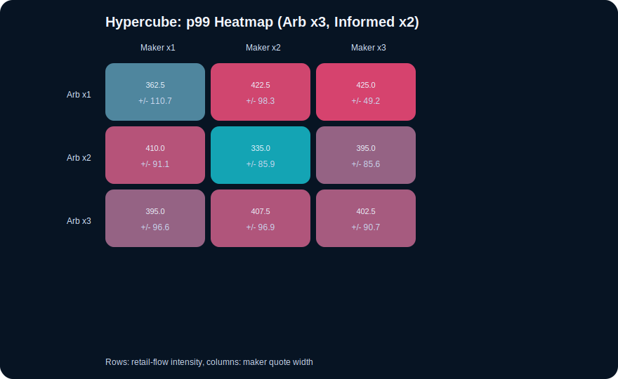

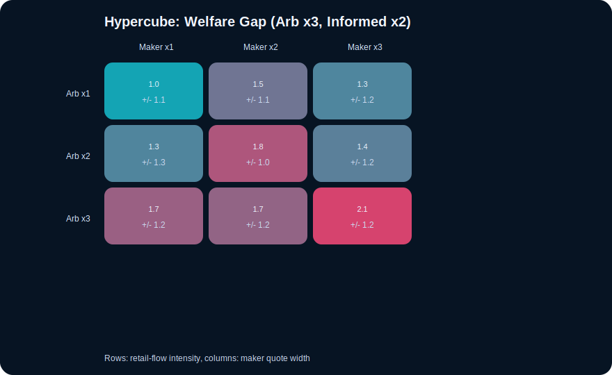

## Reading Guide

- `fairness.svg` still shows the queue-advantage and arbitrage-profit proxy layer
- `welfare.svg` adds direct welfare/behavior signals: retail surplus per traded unit and retail adverse-selection rate
- `grid_*` isolates arbitrage intensity versus maker quote width
- `cube_*` holds retail intensity fixed and shows how informed-flow intensity and maker quote width reshape p99 and arbitrage-profit proxy
- `hyper_*` folds arbitrage back into the unified sweep and makes the welfare-gap surface visible under the same slice convention
