# A Ledger-Aware Benchmark for Market Infrastructure under Frequent Batch Auctions

## Abstract

We present a ledger-aware benchmark track for studying how market mechanisms and lightweight learned controllers trade off latency, fill throughput, and retail outcomes under explicit settlement constraints. The benchmark is designed to study how learning-based controllers operate under settlement-constrained market environments rather than in a matching-only simulator. The environment combines seedable agent-based order flow, configurable immediate, speed-bump, and frequent-batch-auction matching regimes, double-entry style account transitions, and deterministic safety checks for conservation and non-negativity. The paper-facing welfare decomposition is intentionally narrow: retail surplus per traded unit, retail adverse-selection rate, and surplus-transfer gap are treated as the primary outcome family, while broader diagnostics remain in the artifact layer. The current version exposes a step-wise `Reset/Step/Observe/Metrics` API, an adapter-driven control surface, six policy baselines including offline contextual, fitted-Q, and online DQN-style controllers, and a unified four-dimensional stress sweep over arbitrage intensity, retail intensity, informed intensity, and maker quote width. It adds both offline and online learning stories, held-out regime evaluation over unseen stress combinations, and a fitted response-surface summary over the unified hypercube. The main empirical finding is a systematic tension between latency optimization and retail welfare outcomes: controllers that improve tail latency and fill throughput tend to widen surplus-transfer gap, while more balanced controllers give up some latency performance to improve retail outcome. Across all measured runs, settlement invariants remain intact while mechanism and controller choices induce clear latency, fairness, and welfare-transfer tradeoffs.

## 1. Introduction

Electronic markets are shaped jointly by matching rules, latency structure, and settlement semantics. Frequent batch auction arguments motivate short batching windows as a response to latency-driven distortions in continuous markets. In practice, however, evaluation artifacts often study matching rules in isolation and do not explicitly couple them to settlement safety, replay behavior, or account-state correctness.

This manuscript defines a benchmark-oriented layer on top of an existing ledger-first market-infrastructure prototype. The goal is not to replace the original systems paper. The goal is narrower: establish a reusable evaluation environment in which mechanism comparisons and controller experiments are made under explicit settlement constraints, and in which retail outcomes are summarized by a small, interpretable welfare decomposition rather than by a long tail of auxiliary metrics. In that sense, the paper studies how learning-based controllers behave when settlement invariants, replay stability, and market-design choices are all part of the environment definition.

Our goal is not to introduce a new RL algorithm. The goal is to study how learning-based controllers behave when market-infrastructure constraints such as settlement invariants, replay stability, and batch-execution rules are part of the environment definition. That framing matters because the benchmark contribution is not a faster policy update; it is a setting in which controller quality can only be claimed if it survives the same conservation, non-negativity, and mechanism rules as the market itself.

Three points motivate the benchmark directly. First, matching-only simulators are not enough because they omit the settlement and replay constraints that determine whether a controller can be trusted in an infrastructure setting. Second, a ledger-aware benchmark is needed because controller quality should be measured under the same conservation, non-negativity, and mechanism rules that govern the market. Third, the main phenomenon exposed by the benchmark is a latency-welfare tradeoff: controllers that optimize aggressively for p99 latency and fills tend to worsen retail surplus-transfer outcomes, while more balanced controllers improve retail outcome only by giving up some tail performance.

### Why this benchmark is needed

Existing market environments usually emphasize one of three things: historical-replay reinforcement-learning pipelines, multi-agent market simulation, or high-throughput order-book execution. This benchmark is aimed at the gap between them. It is needed because mechanism effects, controller behavior, and settlement semantics are often evaluated in separate layers even though production trading infrastructure couples them tightly. Real market replay also entangles mechanism effects with historical participant behavior and venue-specific structure. A seedable synthetic generator gives controlled stress tests over arbitrage, retail, informed, and maker regimes that would be difficult to isolate cleanly in historical data.

| Environment family | Representative examples | Synthetic or replay control | Multiple mechanisms | Explicit settlement invariants | Learning-control API | Welfare-transfer summary |
| --- | --- | --- | --- | --- | --- | --- |
| Historical replay RL suites | FinRL-Meta | Mostly replay-driven | Limited | No | Yes | No |
| Multi-agent market simulators | ABIDES-Gym | Yes | Limited | No | Yes | Limited |
| High-throughput LOB simulators | JAX-LOB | Typically synthetic | Usually continuous LOB focused | No | Limited | No |
| This benchmark | Ledger-aware market benchmark | Yes, seedable and stressable | Yes: immediate, speed bump, fixed batch, adaptive, learned control | Yes | Yes | Yes |

This paper makes four concrete contributions:

1. It defines an infrastructure-aware, constraint-aware benchmark environment in which market-mechanism experiments are coupled to deterministic settlement checks.
2. It evaluates learned and hand-designed controllers across immediate, speed-bump, fixed-batch, adaptive, and stress regimes under a shared control API.
3. It reports both offline and online learning behavior, including held-out regime generalization and explicit training-curve evidence for FittedQ and OnlineDQN.
4. It summarizes a unified four-dimensional stress surface and shows that arbitrage intensity consistently emerges as the dominant driver of welfare-gap expansion.

## 2. Research Question

Can a ledger-aware benchmark environment make market-design and controller tradeoffs measurable under realistic settlement constraints, instead of evaluating matching mechanisms in isolation?

The benchmark focuses on four concrete questions:

1. How do immediate, speed-bump, adaptive, and fixed-batch execution regimes differ in latency and fill behavior?
2. Can fairness-adjacent proxies such as queue-priority advantage and arbitrage profit be measured in a reproducible environment?
3. Do welfare/behavior metrics such as retail surplus and adverse selection reveal controller tradeoffs that proxy metrics alone miss?
4. Do settlement invariants remain intact while the environment is stressed with heterogeneous agents, burstier order flow, and higher-dimensional workload sweeps?

## 3. Problem Setting

We study a discrete-time environment in which the market state evolves step by step. At each step, the state consists of:

- the buy book
- the sell book
- the vector of account states
- the latent synthetic fundamental used by the order-flow generator

Each scenario fixes:

- a matching mode
- a batch-window size
- risk thresholds
- a population of agents

The benchmark is benchmark-first rather than method-first. It is best read as a constraint-aware learning benchmark: a structured environment in which policy-learning work can be evaluated under explicit infrastructure rules rather than only under matching dynamics.

## 4. Environment Design

The benchmark environment lives in `simulator/` and consists of:

- `types.go`: scenario, order, fill, and result schemas
- `agents.go`: market-maker, retail, informed, and latency-arbitrageur order generation
- `matching.go`: immediate, speed-bump, adaptive, and batch-clearing execution paths
- `env.go`: state progression, settlement application, and invariant checks
- `metrics.go`: market-quality, fairness-proxy, and welfare/behavior measurements
- `adapter.go`: reward-bearing timesteps, control actions, and learned-controller baselines
- `benchmark_test.go`: deterministic regression and artifact generation

The environment exposes:

- `Reset()`
- `Observe()`
- `Step()`
- `Metrics()`

On top of that control surface, the repository now includes an adapter layer with five explicit runtime control channels:

- batch-window override for adaptive scenarios
- risk-limit scaling
- tie-break randomization
- release-cadence control
- price-aggression bias

Benchmark results are only accepted if generated scenarios preserve:

- conservation of cash and inventory
- non-negative account balances and units
- deterministic results for the same seed

## 5. Agent Models

The environment includes four agent classes:

- market makers
- latency arbitrageurs
- retail traders
- informed traders

These agents are intentionally simple. They are not intended as a full behavioral model of real markets. Their role is to create heterogeneous but reproducible workloads that expose mechanism-controller tradeoffs under controlled stress. Richer strategic agents are a natural extension, but they are not required for the benchmark objective in its current form.

## 6. Tasks and Baselines

The current benchmark suite exposes fifteen scenarios:

1. `Immediate-Surrogate`
2. `SpeedBump-50ms`
3. `FBA-100ms`
4. `FBA-250ms`
5. `FBA-500ms`
6. `Adaptive-100-250ms`
7. `Adaptive-OrderFlow-100-250ms`
8. `Adaptive-QueueLoad-100-250ms`
9. `Policy-BurstAware-100-250ms`
10. `Policy-LearnedLinUCB-100-250ms`
11. `Policy-LearnedTinyMLP-100-250ms`
12. `Policy-LearnedOfflineContextual-100-250ms`
13. `Policy-LearnedFittedQ-100-250ms`
14. `Policy-LearnedOnlineDQN-100-250ms`
15. `FBA-250ms-Stress`

The controller suite now contains:

- a hand-written burst-aware baseline
- a contextual linear bandit baseline
- a gradient-trained TinyMLP baseline
- an offline contextual controller trained from logged trajectories generated by burst-aware, LinUCB, TinyMLP, and random behavior policies
- an offline fitted-Q controller trained from logged trajectories generated by burst-aware, LinUCB, TinyMLP, offline contextual, and random behavior policies
- an online DQN-style controller trained directly through adapter interactions on held-in seeds

The discrete action bundle shared by the learned controllers includes:

- batch window
- risk scale
- tie-break mode
- release cadence
- price aggression

## 7. Metrics

The artifact reports five groups of signals.

### 7.1 Systems Metrics

- orders per second
- fills per second
- p50, p95, and p99 latency

### 7.2 Market Quality Metrics

- average spread
- average price impact

### 7.3 Fairness Proxies

- queue-priority advantage
- latency-arbitrage profit
- execution dispersion across agent classes

### 7.4 Welfare Decomposition

The paper line now emphasizes three primary welfare metrics:

- retail surplus per traded unit
- retail adverse-selection rate
- surplus-transfer gap

These three metrics separate retail outcome, adverse selection, and transfer-to-arbitrageur. Secondary diagnostics such as arbitrageur surplus per traded unit and welfare dispersion remain in the artifact layer, but they are no longer the center of the benchmark claim.

These welfare metrics should be interpreted as controlled outcome proxies inside the benchmark environment rather than direct measurements of real-market welfare. Their purpose is to expose systematic tradeoffs between latency optimization and surplus transfer under a fixed synthetic fundamental, not to claim a universal welfare theorem for live markets.

### 7.5 Safety Metrics

- negative-balance violations
- conservation breaches
- risk rejections

## 8. Experimental Setup

We report two result layers:

1. a single-seed reproducibility snapshot
2. an eight-seed aggregate profile

The aggregate profile uses seeds:

`[7, 11, 19, 23, 29, 31, 37, 41]`

The mechanism ablation suite uses `[13, 17, 19, 23]`. The agent/workload sweep uses `[43, 47, 53, 59]`. The parameter grid uses `[61, 67, 71, 73]`. The parameter cube uses `[79, 83, 89, 97]`. The unified hypercube uses `[101, 103, 107, 109]`.

The learned fitted-Q controller uses an explicit offline train/eval split. Logged trajectories are collected on training seeds `[181, 191, 193, 197, 199, 211]` from burst-aware, LinUCB, TinyMLP, offline contextual, and random behavior policies. The fitted-Q loop runs for eight iterations with discount `0.97` over the shared discrete action bundle. The online DQN-style controller uses replay-based Q-learning over the same action bundle on training seeds `[307, 311, 313, 317, 331, 337]`, with checkpoints every 20 episodes through 160 episodes. Held-out evaluation uses seeds `[223, 227, 229, 233]` on four unseen regimes:

- `HeldOut-HighArbWideMaker`
- `HeldOut-RetailBurst`
- `HeldOut-InformedWide`
- `HeldOut-CompositeStress`

All reported scenarios use the same simulator implementation and differ only in matching mode, batch-window size, seed, and population intensity. The current setup uses a discrete-time step duration of `10 ms`.

### 8.1 Learning Specification

The learned controllers share the same adapter interface. The observation vector is 7-dimensional:

- bias term
- queue depth
- buy/sell imbalance
- spread
- pending-order count
- risk-rejection count
- normalized episode progress

The shared action bundle contains 6 discrete control choices over:

- target batch window
- risk-limit scale
- tie-break mode
- release cadence
- price-aggression bias

The per-step reward is the same for all learned controllers:

`reward = +1.0 * fills - 0.25 * spread - 1.5 * price_impact - 12.0 * |queue_advantage| - 0.005 * arbitrage_profit + 18.0 * retail_surplus - 10.0 * retail_adverse - 2.0 * welfare_dispersion - 3.0 * positive_surplus_gap - 0.5 * risk_rejections - 10.0 * conservation_breaches`

The main learning-specific hyperparameters used in the paper are:

| Controller | Function class | Training data / interaction | Main training hyperparameters | Checkpoint rule |
| --- | --- | --- | --- | --- |
| `Policy-LearnedFittedQ-100-250ms` | per-action linear value models | offline logged trajectories from burst-aware, LinUCB, TinyMLP, offline contextual, and random policies on 6 training seeds | `gamma=0.97`, `8` Bellman iterations, linear least-squares refit each iteration, target clamp `[-25, 25]` | all 9 snapshots (`0..8`) evaluated on held-out regimes; iteration `8` is the reported policy |
| `Policy-LearnedOnlineDQN-100-250ms` | TinyMLP Q-network, hidden dim `10` | online interaction on 6 training seeds with replay memory | `gamma=0.97`, `160` episodes, epsilon decays `0.25 -> 0.03`, replay cap `6000`, updates begin after `48` samples, `4` SGD-style Q-updates per step, learning rate `0.0035`, `L2=1e-4`, target refresh every `250` env steps | checkpoints every `20` episodes; episode `160` is the reported policy |

These settings are intentionally lightweight. The benchmark claim is not that these are state-of-the-art learning algorithms; it is that the environment makes their latency-welfare tradeoffs measurable under the same infrastructure constraints.

## 9. Current Results

We report two layers of results:

1. a single-seed reproducibility snapshot in `docs/benchmarks/simulator_benchmark_profile.*`
2. an eight-seed aggregate profile in `docs/benchmarks/simulator_multiseed_profile.*`, reported as `mean +/- CI95`

### 9.1 Multi-Seed Summary

| Scenario | Orders/s | Fills/s | p99 (ms) | Impact | Queue Adv. | Arb Profit | Retail Surplus | Retail Adverse | Welfare Gap |
|---|---:|---:|---:|---:|---:|---:|---:|---:|---:|
| Immediate-Surrogate | 1348.23 +/- 3.99 | 813.13 +/- 18.47 | 10.00 +/- 0.00 | 3.38 +/- 0.23 | 0.0742 +/- 0.0078 | 669.63 +/- 34.30 | -0.3710 +/- 0.1264 | 0.5109 +/- 0.0183 | 2.0430 +/- 0.2444 |
| FBA-250ms | 1337.60 +/- 3.88 | 686.41 +/- 17.80 | 452.50 +/- 16.16 | 5.36 +/- 0.60 | 0.0273 +/- 0.0182 | 627.25 +/- 107.67 | -0.3493 +/- 0.1951 | 0.5105 +/- 0.0268 | 0.8896 +/- 0.8264 |
| Adaptive-100-250ms | 1337.60 +/- 3.88 | 714.29 +/- 22.20 | 360.00 +/- 69.38 | 4.71 +/- 0.49 | 0.0375 +/- 0.0165 | 522.00 +/- 86.23 | -0.1508 +/- 0.1950 | 0.4562 +/- 0.0682 | 0.0278 +/- 0.6078 |
| Policy-BurstAware-100-250ms | 1338.89 +/- 2.97 | 670.83 +/- 28.54 | 400.00 +/- 57.25 | 5.31 +/- 0.52 | 0.0305 +/- 0.0214 | 621.00 +/- 94.21 | -0.2258 +/- 0.2212 | 0.5019 +/- 0.0203 | 0.7579 +/- 0.7681 |
| Policy-LearnedLinUCB-100-250ms | 1337.60 +/- 3.88 | 755.65 +/- 27.48 | 155.00 +/- 17.32 | 5.90 +/- 0.37 | 0.0513 +/- 0.0254 | 976.63 +/- 68.56 | 0.0795 +/- 0.1353 | 0.4690 +/- 0.0231 | 2.1694 +/- 0.7433 |
| Policy-LearnedTinyMLP-100-250ms | 1337.60 +/- 3.88 | 769.35 +/- 20.85 | 221.25 +/- 57.40 | 5.22 +/- 0.41 | 0.0336 +/- 0.0256 | 856.13 +/- 107.16 | -0.3128 +/- 0.1535 | 0.4924 +/- 0.0238 | 1.9719 +/- 0.8498 |
| Policy-LearnedOfflineContextual-100-250ms | 1337.40 +/- 3.91 | 762.80 +/- 36.22 | 215.00 +/- 47.25 | 4.94 +/- 0.57 | 0.0294 +/- 0.0156 | 771.25 +/- 113.73 | -0.1090 +/- 0.1191 | 0.4980 +/- 0.0237 | 1.3769 +/- 0.8055 |
| Policy-LearnedFittedQ-100-250ms | 1337.70 +/- 3.86 | 746.23 +/- 27.90 | 145.00 +/- 21.36 | 5.88 +/- 0.45 | 0.0451 +/- 0.0217 | 966.38 +/- 67.21 | 0.0742 +/- 0.1690 | 0.4738 +/- 0.0151 | 2.2036 +/- 0.6732 |
| Policy-LearnedOnlineDQN-100-250ms | 1337.60 +/- 3.88 | 740.77 +/- 26.35 | 145.00 +/- 21.36 | 5.92 +/- 0.43 | 0.0431 +/- 0.0219 | 963.75 +/- 66.83 | 0.0662 +/- 0.1681 | 0.4714 +/- 0.0170 | 2.2472 +/- 0.7078 |
| FBA-250ms-Stress | 1769.25 +/- 6.04 | 900.50 +/- 23.67 | 373.75 +/- 70.24 | 5.35 +/- 0.51 | 0.0269 +/- 0.0272 | 2057.00 +/- 235.64 | -0.1494 +/- 0.1905 | 0.4995 +/- 0.0234 | 0.3805 +/- 0.8714 |

### 9.2 Observations

- Immediate execution retains the lowest latency profile, but it also carries the widest spread (`1.98 +/- 0.17`) and a high welfare gap (`2.0430 +/- 0.2444`).
- The `50 ms` speed-bump baseline raises latency without reducing queue advantage; it keeps `0.0742 +/- 0.0078` queue advantage and worsens welfare gap to `4.1034 +/- 0.3793`.
- The fixed `250 ms` batch regime lowers queue advantage to `0.0273 +/- 0.0182` and compresses welfare gap relative to immediate execution, but it gives up substantial tail latency.
- The balanced adaptive heuristic is the strongest fixed-logic controller on combined welfare terms: it keeps price impact low (`4.71 +/- 0.49`), reduces arbitrage-profit proxy to `522.00 +/- 86.23`, and nearly closes the welfare gap (`0.0278 +/- 0.6078`).
- `Policy-LearnedLinUCB-100-250ms` remains strong on tail latency and fill throughput, but it does so by widening queue advantage and surplus-transfer gap.
- `Policy-LearnedTinyMLP-100-250ms` improves fills further, but leaves both retail surplus and welfare gap worse than the offline contextual baseline.
- `Policy-LearnedOfflineContextual-100-250ms` is the strongest balanced learned baseline in the benchmark: compared with `LinUCB`, it gives up some tail latency but cuts price impact (`4.94` versus `5.90`), lowers queue advantage (`0.0294` versus `0.0513`), lowers arbitrage-profit proxy (`771.25` versus `976.63`), and shrinks the welfare gap (`1.3769` versus `2.1694`).
- `Policy-LearnedFittedQ-100-250ms` is the strongest in-distribution learned controller on p99 (`145.00 +/- 21.36 ms`), but it still behaves more like `LinUCB` than `OfflineContextual` on transfer-to-arbitrageur: its welfare gap (`2.2036 +/- 0.6732`) is lower than `LinUCB` only marginally and much worse than `OfflineContextual`.
- `Policy-LearnedOnlineDQN-100-250ms` reaches the same in-distribution p99 band as `FittedQ`, improves held-out fills relative to both `FittedQ` and `OfflineContextual`, and reinforces the central learning result: latency-favoring policies can emerge quickly even when they worsen welfare-transfer outcomes.

### 9.3 Held-Out Regime Generalization

Held-out results in `docs/benchmarks/simulator_heldout_policy_profile.*` use unseen seeds `[223, 227, 229, 233]` and four unseen regime combinations. The policy summary is:

| Policy | Fills/s | p99 (ms) | Impact | Retail Surplus | Retail Adverse | Welfare Gap |
|---|---:|---:|---:|---:|---:|---:|
| burst_aware | 834.08 | 376.88 | 5.32 | -0.4042 | 0.5200 | 1.6286 |
| learned_linucb | 978.52 | 171.25 | 5.76 | 0.1215 | 0.4916 | 2.4466 |
| learned_offline_contextual | 961.61 | 275.62 | 5.38 | -0.0732 | 0.4703 | 1.9535 |
| learned_fitted_q | 946.78 | 159.38 | 5.92 | 0.1110 | 0.4952 | 2.3158 |
| learned_online_dqn | 986.61 | 172.50 | 5.70 | 0.0937 | 0.4910 | 2.2189 |

The held-out picture is materially different from the in-distribution aggregate. `FittedQ` lowers both `p99` and welfare gap relative to `LinUCB` in `HeldOut-HighArbWideMaker`, `HeldOut-RetailBurst`, and `HeldOut-CompositeStress`. In `HeldOut-InformedWide`, it gives up some tail latency (`182.50` versus `167.50 ms`) but still lowers welfare gap (`2.2994` versus `2.3765`). `OfflineContextual` remains the most welfare-balanced learned baseline overall, but it is materially slower than both `LinUCB` and `FittedQ` on held-out tails. `OnlineDQN` sits between them: averaged over the four held-out regimes it improves fills to `986.61`, keeps p99 at `172.50 ms`, and lowers welfare gap to `2.2189`, which is better than both `LinUCB` and `FittedQ` on the held-out aggregate.

### 9.4 Fitted-Q Learning Curve

The new fitted-Q learning-curve artifact in `docs/benchmarks/simulator_fittedq_learning_curve.*` makes the training story explicit instead of leaving the controller as a black-box baseline.

| Iteration | Bellman MSE | Fills/s | p99 (ms) | Retail Surplus | Retail Adverse | Welfare Gap |
|---:|---:|---:|---:|---:|---:|---:|
| 0 | 0.0000 | 875.99 +/- 159.10 | 341.25 +/- 22.97 | -0.7067 +/- 0.1909 | 0.5293 +/- 0.0121 | 3.2117 +/- 0.5538 |
| 1 | 45.1571 | 960.57 +/- 182.21 | 198.75 +/- 25.39 | -0.0251 +/- 0.1070 | 0.4999 +/- 0.0179 | 2.0790 +/- 0.4767 |
| 8 | 6.5753 | 944.25 +/- 176.56 | 155.62 +/- 12.84 | 0.1177 +/- 0.1193 | 0.4961 +/- 0.0154 | 2.4226 +/- 0.5400 |

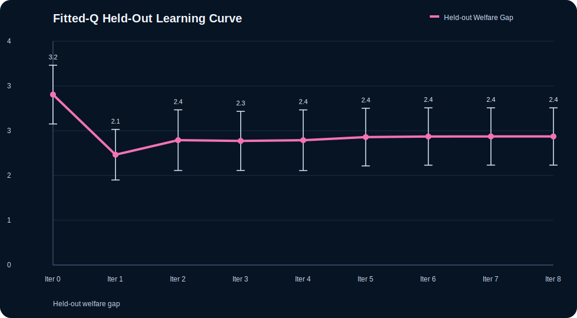

The pattern is useful rather than cosmetic. The first Bellman update captures most of the welfare-gap improvement over the untrained snapshot, while later iterations keep reducing Bellman error and held-out p99. The final controller is therefore faster on tail latency than the early snapshot, but it gives back part of the early welfare improvement. That is exactly the kind of benchmark-plus-learning tradeoff this track is meant to expose.

### 9.5 Online DQN Learning Curve

The online DQN-style controller now adds a second, explicitly online training story in `docs/benchmarks/simulator_online_dqn_training_curve.*`. The untrained snapshot begins at `p99 200.00 +/- 25.46 ms` and welfare gap `1.5898 +/- 0.3869`. By episode `20`, held-out p99 falls to `155.62 +/- 12.84 ms`, while welfare gap rises to `2.4226 +/- 0.5400`. Later checkpoints stay on the same plateau. In other words, the controller converges quickly toward a latency-favoring regime. The benchmark therefore exposes not just a better baseline, but a learning dynamic: under the current reward structure, latency improvement is easier for the policy to exploit than retail-welfare preservation.

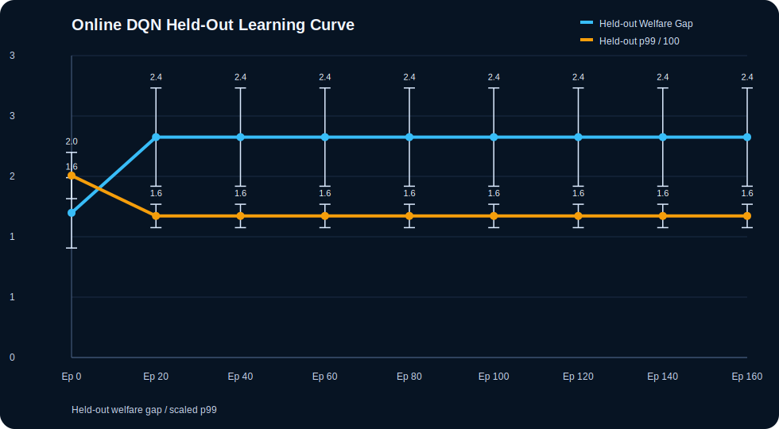

### 9.6 Pareto Frontier

The multiseed controller Pareto frontier in `docs/benchmarks/simulator_controller_pareto.*` uses `p99 latency` and `surplus-transfer gap` as the two minimized axes, with `fills/s` kept as a third interpretation axis.

- `Immediate-Surrogate` is the fastest frontier point, but it sits at a high welfare gap (`2.0430`).
- `Policy-LearnedOfflineContextual-100-250ms` is the strongest balanced learned frontier point: slower than `LinUCB`, `FittedQ`, and `OnlineDQN`, but much lower on welfare gap (`1.3769`).
- `Adaptive-100-250ms` is the low-gap frontier point (`0.0278`), but it gives up substantial latency tail.

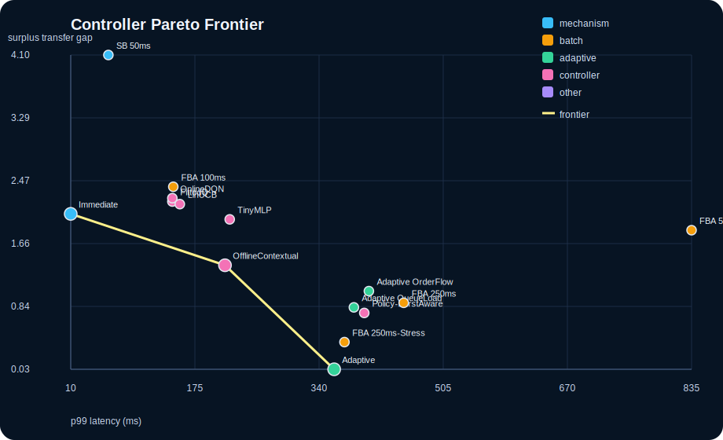

### 9.7 Visual Summary

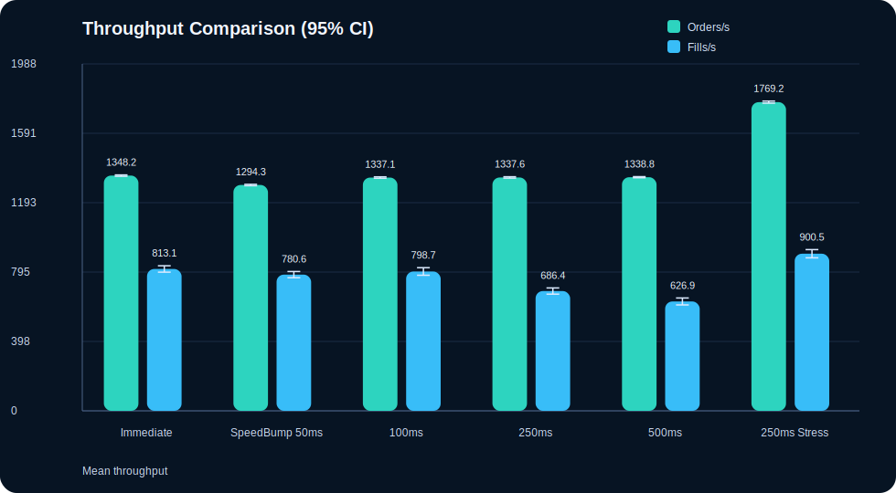

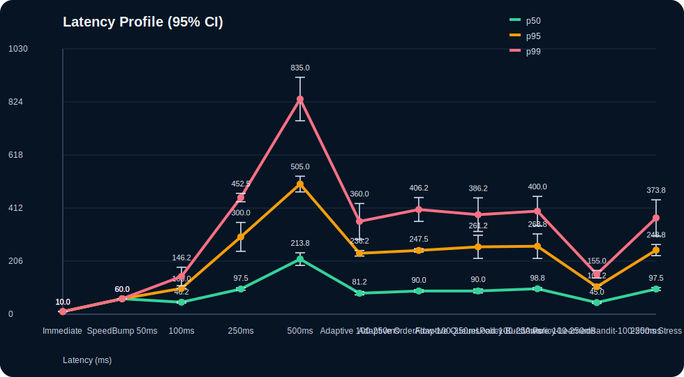

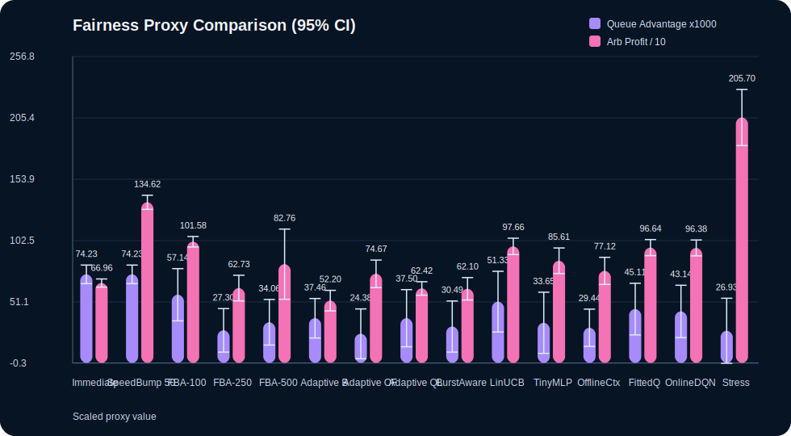

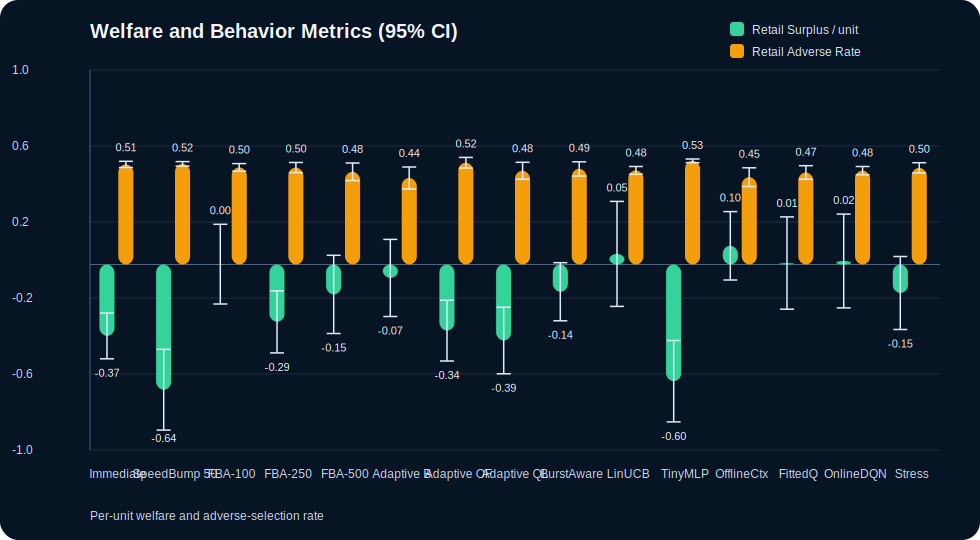

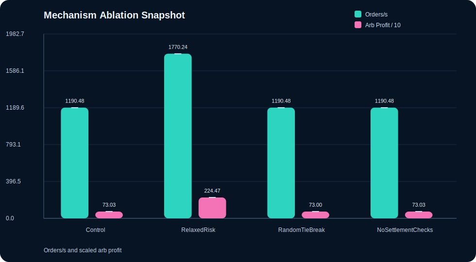

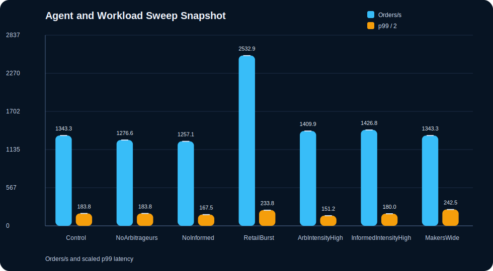

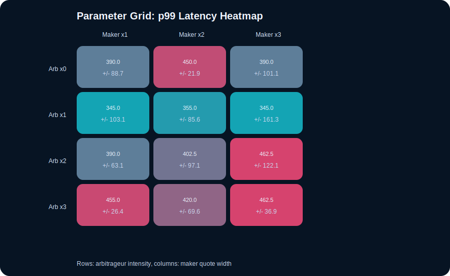

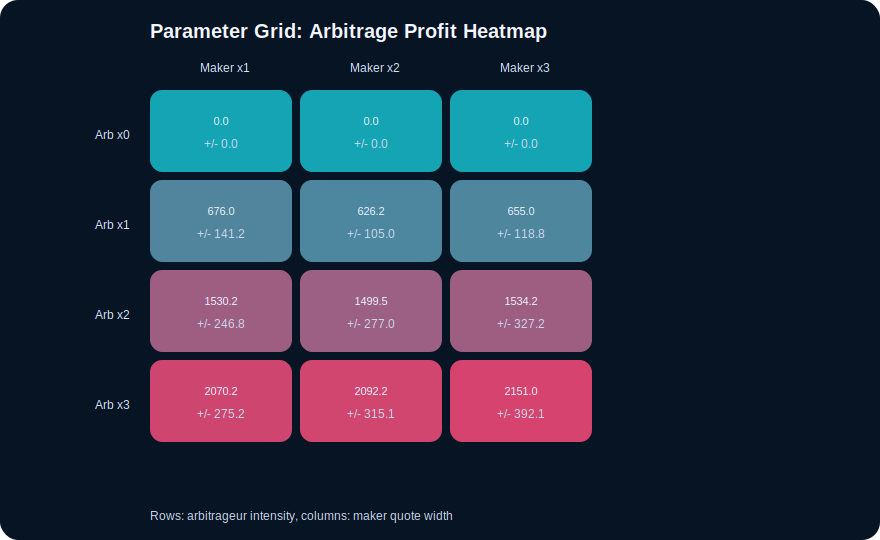

The full appendix figure set, including cube and hypercube slices, is collected in `APPENDIX_FIGURES.md`.

### 9.6 Mechanism Ablation Snapshot

From `docs/benchmarks/simulator_ablation_profile.*` over seeds `[13, 17, 19, 23]`:

| Scenario | Orders/s | Fills/s | p99 (ms) | Queue Adv. | Arb Profit | Risk Rejects | Safety Violations |
|---|---:|---:|---:|---:|---:|---:|---:|
| Ablation-Control | 1190.48 | 605.36 | 320.00 | -0.0509 | 685.25 | 2922 | 0 |
| Ablation-RelaxedRisk | 1770.24 | 925.79 | 302.50 | 0.0372 | 2198.50 | 0 | 0 |
| Ablation-RandomTieBreak | 1190.48 | 595.63 | 402.50 | -0.0540 | 738.50 | 2908 | 0 |
| Ablation-NoSettlementChecks | 1190.48 | 605.36 | 320.00 | -0.0509 | 685.25 | 2922 | 0 |

These ablations show that relaxing risk limits is not a free lunch: it raises throughput, but also sharply increases arbitrage capture.

### 9.7 Agent and Workload Sweep Snapshot

From `docs/benchmarks/simulator_agent_ablation_profile.*` over seeds `[43, 47, 53, 59]`:

| Scenario | Orders/s | Fills/s | p99 (ms) | Impact | Queue Adv. | Arb Profit |
|---|---:|---:|---:|---:|---:|---:|
| AgentAblation-Control | 1343.25 | 659.52 | 367.50 | 5.49 | 0.0408 | 754.00 |
| AgentAblation-NoArbitrageurs | 1276.59 | 622.62 | 367.50 | 5.38 | -0.5958 | 0.00 |
| AgentAblation-NoInformed | 1257.14 | 622.62 | 335.00 | 5.54 | 0.0260 | 750.25 |
| AgentSweep-RetailBurst | 2532.94 | 1427.18 | 467.50 | 5.70 | 0.0404 | 821.75 |
| AgentSweep-ArbIntensityHigh | 1409.92 | 718.45 | 302.50 | 5.80 | 0.0314 | 1730.75 |
| AgentSweep-InformedIntensityHigh | 1426.79 | 724.01 | 360.00 | 5.62 | 0.0111 | 685.50 |
| AgentSweep-MakersWide | 1343.25 | 595.63 | 485.00 | 5.81 | 0.0469 | 754.50 |

The sweeps make clear that the benchmark is sensitive to population composition and workload intensity, not only to the matching rule.

### 9.8 Parameter Grid, Cube, and Unified Hypercube

The benchmark now exposes three sensitivity surfaces:

- a `4 x 3` arbitrage x maker grid
- a `3 x 3 x 3` retail x informed x maker cube
- a unified `4 x 3 x 3 x 3` hypercube over arbitrage, retail, informed, and maker width

Selected raw hypercube cells from `docs/benchmarks/simulator_parameter_hypercube_profile.*` over seeds `[101, 103, 107, 109]`:

| Arb | Retail | Informed | Maker Width | Orders/s | Fills/s | p99 (ms) | Arb Profit | Retail Surplus | Retail Adverse | Welfare Gap |
|---:|---:|---:|---:|---:|---:|---:|---:|---:|---:|---:|
| 0 | 1 | 2 | 1 | 1350.60 | 676.39 | 412.50 | 0.00 | -0.2376 | 0.4963 | 0.2376 |
| 3 | 1 | 2 | 1 | 1542.86 | 806.94 | 362.50 | 1982.00 | -0.5444 | 0.4823 | 1.2839 |
| 0 | 3 | 2 | 1 | 2147.02 | 1105.75 | 397.50 | 0.00 | -0.1335 | 0.4819 | 0.1335 |
| 3 | 3 | 2 | 3 | 2291.67 | 1005.95 | 402.50 | 2285.50 | -0.4598 | 0.5434 | 1.8005 |

These cells show that higher throughput does not imply better welfare. Adding arbitrage pressure widens the surplus-transfer gap even when p99 falls, while high retail intensity alone mainly loads throughput and fills.

The compact summary in `docs/benchmarks/simulator_parameter_hypercube_summary.*` makes the same point more directly:

| Factor | High-Low Delta Orders/s | Delta Retail Surplus | Delta Retail Adverse | Delta Welfare Gap |
|---|---:|---:|---:|---:|
| arbitrageur intensity `0 -> 3` | 176.26 | -0.1804 | 0.0117 | 1.2099 |
| retail intensity `1 -> 3` | 780.94 | 0.0772 | 0.0018 | 0.0781 |
| informed intensity `1 -> 3` | 150.91 | -0.1986 | 0.0131 | 0.0876 |
| maker quote width `1 -> 3` | 0.00 | -0.1250 | 0.0085 | 0.2653 |

This summary removes the need to interpret the hypercube only through slice families. Arbitrage intensity consistently emerges as the dominant driver of welfare-gap expansion across the stress surface, retail intensity is mostly a throughput lever, and wider maker quotes worsen retail outcome without moving aggregate activity in this setup.

Retail-conditioned arbitrage deltas reinforce the same point. Averaged over informed intensity and maker width, moving from `arb=0` to `arb=3` widens the welfare gap by `1.1748`, `1.2262`, and `1.2287` at retail intensities `x1`, `x2`, and `x3`, respectively. This effect persists across retail intensities. Higher retail flow does not neutralize transfer-to-arbitrageur.

The new response-surface fit in `docs/benchmarks/simulator_parameter_hypercube_response_surface.*` compresses the same hypercube into standardized main effects and pairwise interactions. For `surplus_transfer_gap`, the fitted model reaches `R^2 = 0.3495`, with `arbitrageur_intensity` dominating partial variance explained (`0.3157`) and `maker_quote_width` the next largest effect (`0.0291`). For `retail_surplus_per_unit`, the fit reaches `R^2 = 0.7061`; here `informed_intensity` (`0.3121`) and `arbitrageur_intensity` (`0.2374`) dominate the effect ranking. Rather than reporting slice plots alone, the benchmark now summarizes the stress surface with response-surface fits and factor contrasts that expose the dominant drivers of welfare transfer. This moves the paper beyond purely descriptive slice analysis.

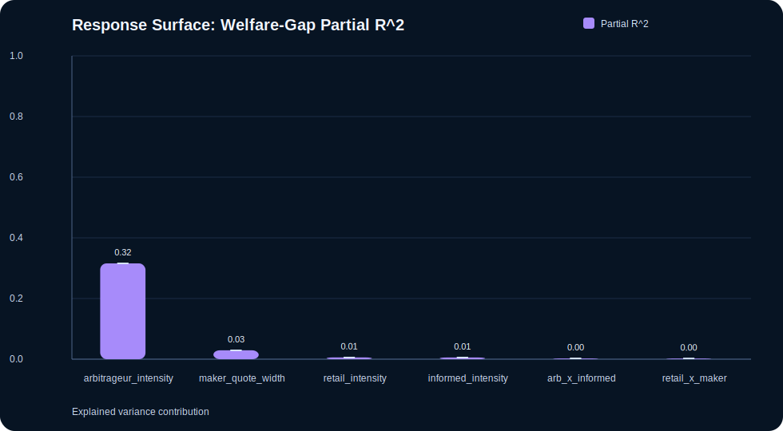

## 10. Limitations

The benchmark has clear remaining limitations. The most important ones are:

- the learned-controller family is still lightweight and discrete-action, even after adding the fitted-Q baseline
- welfare metrics are derived from a synthetic fundamental rather than real market replay
- the response surface is still low-order and pairwise; it is not yet a richer non-linear interaction model
- the agent behaviors are stylized and do not yet include richer strategic adaptation

## 11. Related Work

This NeurIPS-track manuscript should be treated as a separate line from the existing systems-paper manuscript in `docs/PAPER_MANUSCRIPT.md` and the original arXiv sources in `docs/arxiv/`. The systems paper argues for a ledger-first market-infrastructure design. This benchmark paper argues for a reusable evaluation environment built on top of the same settlement constraints.

The benchmark is motivated directly by frequent-batch-auction market design and by the broader practice of reusable benchmark environments in machine learning. The present contribution sits between those traditions: it is neither a pure market-design theory paper nor a standard reinforcement-learning benchmark, but an infrastructure-aware environment that aims to make later policy-learning work more credible. The specific gap it targets is not “another simulator,” but a benchmark in which controller evaluation is inseparable from settlement semantics, mechanism variation, and outcome transfer to or from retail flow.

## 12. Conclusion

This benchmark should be read as a constraint-aware learning environment rather than as a trading simulator alone. Its central empirical result is structural rather than cosmetic: controllers that optimize aggressively for latency and fill throughput tend to worsen retail welfare outcomes by widening surplus-transfer gap, while more balanced controllers improve retail outcome only by accepting some tail-latency cost. The stress-surface analysis shows that arbitrage intensity is the main driver of this welfare-gap expansion, and the learning curves show that both offline and online policies can move quickly toward latency-favoring behavior. Taken together, these results make the benchmark useful not just for mechanism comparison, but for studying learning under infrastructure constraints.
