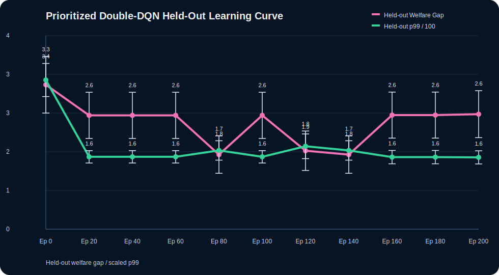
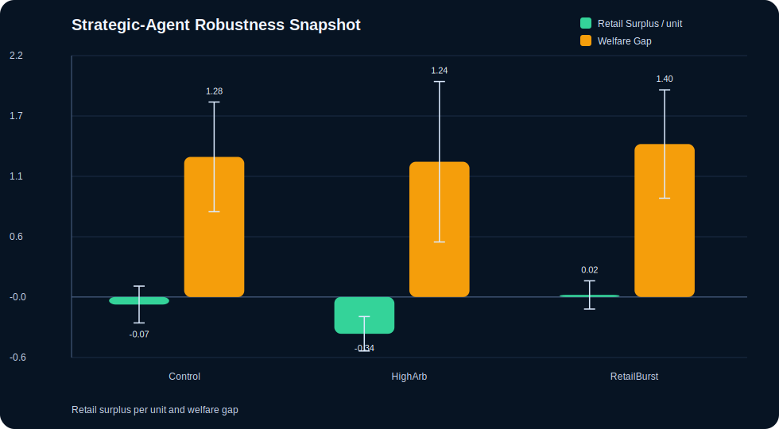

# NeurIPS Track

This directory is a parallel benchmark-paper line. It does not replace the original systems-paper material in `docs/PAPER_MANUSCRIPT.md` or `docs/arxiv/`.

The scope of this paper line is intentionally narrow. It is centered on one benchmark question: how mechanism and controller choices trade off latency/fills against retail outcomes and transfer-to-arbitrageur under explicit settlement constraints. In particular, this track studies how learning-based controllers operate under settlement-constrained market environments rather than in a matching-only simulator. The current line now includes offline and online learning stories, a controller Pareto frontier, and a fitted response-surface summary over the unified hypercube. The paper-facing claim is singular: the benchmark exposes a persistent tension between latency optimization and retail welfare that remains qualitatively stable under stronger learning baselines, first-pass real-data calibration, and counterfactual controls.

## Purpose

This track upgrades the repo toward a benchmark/simulator paper with:

- a seedable agent-based market simulator
- multiple market-design regimes
- a step-wise `Reset/Step/Observe/Metrics` API
- a gym-style adapter with runtime controls for batch window, risk scale, tie-break mode, release cadence, and price aggression
- adapter-driven policy baselines, including offline contextual, fitted-Q, and online DQN-style controllers
- a stronger prioritized Double-DQN style online-learning artifact
- a logged-trajectory training split plus held-out regime evaluation for learned policies
- a strategic-agent robustness layer with inventory-aware makers, trend-reactive retail flow, signal-scaled informed traders, and dislocation-sensitive arbitrageurs
- ledger-aware settlement semantics and explicit invariant checks
- reproducible benchmark artifacts, sweeps, and appendix figures
- a paper-facing welfare decomposition built around `retail_surplus_per_unit`, `retail_adverse_selection_rate`, and `surplus_transfer_gap`
- a real-data calibration pipeline with smoke and multi-symbol Binance Spot stylized-fact artifacts

## Key Components

- `simulator/`: environment, agent models, metrics, adapter, and benchmark tests
- `docs/benchmarks/simulator_benchmark_profile.*`: generated single-seed outputs
- `docs/benchmarks/simulator_multiseed_profile.*`: multi-seed aggregate outputs
- `docs/benchmarks/simulator_ablation_profile.*`: mechanism ablation outputs
- `docs/benchmarks/simulator_agent_ablation_profile.*`: agent/workload ablation outputs
- `docs/benchmarks/simulator_parameter_grid_profile.*`: arbitrage x maker grid
- `docs/benchmarks/simulator_parameter_cube_profile.*`: retail x informed x maker cube
- `docs/benchmarks/simulator_parameter_hypercube_profile.*`: arbitrage x retail x informed x maker unified sweep
- `docs/benchmarks/simulator_parameter_hypercube_summary.*`: compact main-effect and high-low contrast summary for the unified sweep
- `docs/benchmarks/simulator_parameter_hypercube_response_surface.*`: fitted low-order response-surface summary over the same unified sweep
- `docs/benchmarks/simulator_heldout_policy_profile.*`: held-out regime generalization results for learned controllers
- `docs/benchmarks/simulator_controller_pareto.*`: multiseed Pareto frontier over p99 latency vs surplus-transfer gap
- `docs/benchmarks/simulator_online_dqn_training_curve.*`: online DQN-style held-out learning curve
- `docs/benchmarks/simulator_double_dqn_training_curve.*`: prioritized Double-DQN held-out learning curve
- `docs/benchmarks/simulator_online_dqn_reward_sensitivity.*`: held-out reward-weight sensitivity for the online DQN controller
- `docs/benchmarks/simulator_fittedq_learning_curve.*`: fitted-Q training snapshots evaluated on held-out regimes
- `docs/benchmarks/simulator_runtime_profile.*`: reference-machine throughput measurement for the unified hypercube
- `docs/benchmarks/simulator_strategic_agent_profile.*`: richer strategic-agent robustness profile
- `docs/benchmarks/binance_spot_smoke_facts.*`: first end-to-end real-data smoke artifact
- `docs/benchmarks/binance_spot_multimarket_facts.*`: first cross-symbol calibration envelope
- `docs/benchmarks/binance_spot_smoke_provenance.*`: checksum and manifest summary for the smoke raw-data bundle
- `docs/benchmarks/binance_spot_multimarket_provenance.*`: checksum and manifest summary for the multi-symbol raw-data bundle
- `docs/benchmarks/simulator_calibration_target_table.*`: first market-to-simulator target bundle
- `docs/benchmarks/simulator_calibrated_vs_market.*`: first-pass tuned-generator versus market comparison
- `docs/benchmarks/simulator_calibrated_benchmark_profile.*`: latency-welfare benchmark rerun under the tuned generator
- `docs/benchmarks/simulator_calibrated_policy_protocol.*`: formal calibrated train/validation/held-out protocol for PPO- and IQL-style baselines
- `docs/benchmarks/simulator_counterfactual_controls.*`: matching-only, no-settlement, and no-welfare-reward controls
- `NEURIPS_BENCHMARK_MANUSCRIPT.md`: benchmark-oriented manuscript draft
- `ENVIRONMENT_SCHEMA.md`: observation, action, reward, and metrics schema
- `CALIBRATION_PROTOCOL.md`: realism-upgrade protocol and target envelope
- `ROADMAP_TODO.md`: durable backlog for P0/P1/P2 benchmark upgrades
- `APPENDIX_TABLES.md`: appendix-ready controller, ablation, and sweep tables
- `APPENDIX_FIGURES.md`: repository-hosted figure set
- `arxiv/`: isolated LaTeX source and compiled PDF for this paper line

## Artifact Provenance

Use the following boundary consistently in the paper and in any external discussion.

### Real-data artifacts

These come directly from public Binance Spot downloads or deterministic transforms of those downloads:

- `docs/benchmarks/binance_spot_smoke_facts.*`
- `docs/benchmarks/binance_spot_multimarket_facts.*`
- `docs/benchmarks/binance_spot_smoke_provenance.*`
- `docs/benchmarks/binance_spot_multimarket_provenance.*`
- raw files under `data/market_calibration/binance_spot/...`

The provenance artifacts include manifest hashes and per-file SHA-256 checksums. For example:

- `binance_spot_multimarket_provenance`: manifest SHA-256 `776456d05b45c128320743e2cb213cf7b071eb15aa82430a20893cc228021a00`
- `binance_spot_smoke_provenance`: manifest SHA-256 `e195d49da85db57e49ef40eff146dd785e6852995935418619f0b896017b8401`

### Synthetic artifacts

All `simulator_*` artifacts are outputs of the synthetic benchmark environment, including:

- `docs/benchmarks/simulator_multiseed_profile.*`
- `docs/benchmarks/simulator_heldout_policy_profile.*`
- `docs/benchmarks/simulator_calibrated_benchmark_profile.*`
- `docs/benchmarks/simulator_calibrated_policy_protocol.*`
- `docs/benchmarks/simulator_counterfactual_controls.*`

These artifacts are not real-market replay results. They are simulator outputs produced after calibration targets were defined.

### Mixed calibration artifacts

These compare real-data envelopes against synthetic generator outputs:

- `docs/benchmarks/simulator_calibration_target_table.*`
- `docs/benchmarks/simulator_calibrated_vs_market.*`

The `Market Range` columns in those artifacts come from real-data facts; the `Baseline` and `Calibrated` columns come from the simulator.

## Current Single-Seed Snapshot

From `docs/benchmarks/simulator_benchmark_profile.json`:

- `Immediate-Surrogate`: `1360.0 orders/s`, `p50 10 ms`, `p99 10 ms`, retail surplus `-0.3237`
- `SpeedBump-50ms`: `1305.6 orders/s`, `p50 60 ms`, `p99 60 ms`, retail adverse rate `0.5078`
- `FBA-250ms`: `1347.6 orders/s`, `p50 80 ms`, `p99 490 ms`, retail surplus `-0.4599`
- `Policy-LearnedLinUCB-100-250ms`: `1347.6 orders/s`, `p50 50 ms`, `p99 130 ms`, retail surplus `0.3975`
- `Policy-LearnedTinyMLP-100-250ms`: `1347.6 orders/s`, `p50 60 ms`, `p99 300 ms`, price impact `4.24`
- `Policy-LearnedOfflineContextual-100-250ms`: `1349.2 orders/s`, `p50 80 ms`, `p99 200 ms`, impact `3.18`, retail adverse rate `0.4014`
- `Policy-LearnedFittedQ-100-250ms`: `1347.6 orders/s`, `p50 50 ms`, `p99 120 ms`, retail surplus `0.3731`, welfare gap `1.6269`
- `Policy-LearnedOnlineDQN-100-250ms`: `1347.6 orders/s`, `p50 50 ms`, `p99 120 ms`, retail surplus `0.3731`, welfare gap `1.6269`
- `FBA-250ms-Stress`: `1761.1 orders/s`, `p50 100 ms`, `p99 590 ms`

All generated scenarios currently report:

- `0` negative-balance violations
- `0` conservation breaches

## Multi-Seed Snapshot

From `docs/benchmarks/simulator_multiseed_profile.json`, aggregated over seeds `[7, 11, 19, 23, 29, 31, 37, 41]` and reported as `mean +/- CI95`:

- `Immediate-Surrogate`: `1348.23 +/- 3.99 orders/s`, `p99 10.00 +/- 0.00 ms`, retail surplus `-0.3710 +/- 0.1264`, welfare gap `2.0430 +/- 0.2444`
- `FBA-250ms`: `1337.60 +/- 3.88 orders/s`, `p99 452.50 +/- 16.16 ms`, queue `0.0273 +/- 0.0182`, welfare gap `0.8896 +/- 0.8264`
- `Adaptive-100-250ms`: `1337.60 +/- 3.88 orders/s`, adaptive mean `207.14 ms`, impact `4.71 +/- 0.49`, welfare gap `0.0278 +/- 0.6078`
- `Policy-BurstAware-100-250ms`: `1338.89 +/- 2.97 orders/s`, `p99 400.00 +/- 57.25 ms`, arb `621.00 +/- 94.21`, retail adverse `0.5019 +/- 0.0203`
- `Policy-LearnedLinUCB-100-250ms`: `1337.60 +/- 3.88 orders/s`, `755.65 +/- 27.48 fills/s`, `p99 155.00 +/- 17.32 ms`, retail surplus `0.0795 +/- 0.1353`, welfare gap `2.1694 +/- 0.7433`
- `Policy-LearnedTinyMLP-100-250ms`: `1337.60 +/- 3.88 orders/s`, `769.35 +/- 20.85 fills/s`, `p99 221.25 +/- 57.40 ms`, arb `856.13 +/- 107.16`, retail surplus `-0.3128 +/- 0.1535`
- `Policy-LearnedOfflineContextual-100-250ms`: `1337.40 +/- 3.91 orders/s`, `762.80 +/- 36.22 fills/s`, `p99 215.00 +/- 47.25 ms`, impact `4.94 +/- 0.57`, queue `0.0294 +/- 0.0156`, arb `771.25 +/- 113.73`, retail surplus `-0.1090 +/- 0.1191`
- `Policy-LearnedFittedQ-100-250ms`: `1337.70 +/- 3.86 orders/s`, `746.23 +/- 27.90 fills/s`, `p99 145.00 +/- 21.36 ms`, queue `0.0451 +/- 0.0217`, retail surplus `0.0742 +/- 0.1690`, welfare gap `2.2036 +/- 0.6732`
- `Policy-LearnedOnlineDQN-100-250ms`: `1337.60 +/- 3.88 orders/s`, `740.77 +/- 26.35 fills/s`, `p99 145.00 +/- 21.36 ms`, queue `0.0431 +/- 0.0219`, retail surplus `0.0662 +/- 0.1681`, welfare gap `2.2472 +/- 0.7078`
- `FBA-250ms-Stress`: `1769.25 +/- 6.04 orders/s`, `900.50 +/- 23.67 fills/s`, `p99 373.75 +/- 70.24 ms`, arb `2057.00 +/- 235.64`

Current controller interpretation:

- `FittedQ` is now the fastest learned controller on in-distribution tail latency (`145.00 +/- 21.36 ms`), but it still behaves closer to `LinUCB` than to `OfflineContextual` on surplus-transfer gap.
- `TinyMLP` improves fills, but still leaves retail surplus negative and keeps arbitrage capture high.
- `OfflineContextual` is still the most balanced learned baseline in the current repo: it keeps p99 far below burst-aware, cuts price impact below both `LinUCB` and `FittedQ`, and keeps the smallest welfare gap among the learned policies.
- `FittedQ` adds a minimal offline-RL style training story and currently pushes the best in-distribution p99 (`145.00 +/- 21.36 ms`) while staying better than `LinUCB` on held-out welfare gap in every published regime, but it still widens transfer-to-arbitrageur relative to `OfflineContextual`.
- `OnlineDQN` reaches the same in-distribution p99 band as `FittedQ`, improves held-out fills to `986.61`, and lowers held-out welfare gap to `2.2189`, but it converges quickly toward a latency-favoring regime rather than preserving the early welfare advantage.
- `DoubleDQN` is now available as a stronger online-RL artifact: intermediate checkpoints reach `1079.32 +/- 183.72 fills/s` with welfare gap `1.6813 +/- 0.4221`, but later checkpoints drift back toward the latency-favoring regime.

## Offline Training and Held-Out Generalization

The current learning line now has an explicit train/eval split instead of only online or imitation-style controllers.

- training seeds for the offline fitted-Q controller: `[181, 191, 193, 197, 199, 211]`
- held-out evaluation seeds: `[223, 227, 229, 233]`
- logged behavior sources: `BurstAware`, `LinUCB`, `TinyMLP`, `OfflineContextual`, plus random rollouts
- shared control surface: batch window, risk scale, tie-break mode, release cadence, and price aggression

Held-out regimes in `docs/benchmarks/simulator_heldout_policy_profile.*`:

- `HeldOut-HighArbWideMaker`
- `HeldOut-RetailBurst`
- `HeldOut-InformedWide`
- `HeldOut-CompositeStress`

Held-out policy summary:

- `burst_aware`: `834.08 fills/s`, `p99 376.88 ms`, retail surplus `-0.4042`, welfare gap `1.6286`
- `learned_linucb`: `978.52 fills/s`, `p99 171.25 ms`, retail surplus `0.1215`, welfare gap `2.4466`
- `learned_offline_contextual`: `961.61 fills/s`, `p99 275.62 ms`, retail surplus `-0.0732`, welfare gap `1.9535`
- `learned_fitted_q`: `946.78 fills/s`, `p99 159.38 ms`, retail surplus `0.1110`, welfare gap `2.3158`
- `learned_online_dqn`: `986.61 fills/s`, `p99 172.50 ms`, retail surplus `0.0937`, welfare gap `2.2189`

Most important held-out observation:

- against `LinUCB`, `FittedQ` lowers both `p99` and welfare gap in `HeldOut-HighArbWideMaker`, `HeldOut-RetailBurst`, and `HeldOut-CompositeStress`
- in `HeldOut-InformedWide`, `FittedQ` gives up some p99 (`182.50` vs `167.50 ms`) but still lowers welfare gap (`2.2994` vs `2.3765`)
- `OfflineContextual` remains the most welfare-balanced learned baseline overall, but it is clearly slower than both `LinUCB` and `FittedQ` on held-out tails
- `OnlineDQN` sits between `LinUCB` and `OfflineContextual`: it improves held-out fills, keeps p99 near `LinUCB`, and lowers held-out welfare gap relative to both `LinUCB` and `FittedQ`

### Fitted-Q Learning Curve

From `docs/benchmarks/simulator_fittedq_learning_curve.*`, evaluated on the same held-out regime set:

- untrained snapshot (`iteration 0`): `p99 341.25 +/- 22.97 ms`, welfare gap `3.2117 +/- 0.5538`
- after the first Bellman update (`iteration 1`): `p99 198.75 +/- 25.39 ms`, welfare gap `2.0790 +/- 0.4767`
- by `iteration 8`: Bellman MSE falls from `45.1571` to `6.5753`, `p99` reaches `155.62 +/- 12.84 ms`, and welfare gap stabilizes at `2.4226 +/- 0.5400`

Online DQN held-out learning curve in `docs/benchmarks/simulator_online_dqn_training_curve.*`:

- untrained snapshot (`episode 0`): `p99 200.00 +/- 25.46 ms`, welfare gap `1.5898 +/- 0.3869`
- by `episode 20`: `p99 155.62 +/- 12.84 ms`, welfare gap `2.4226 +/- 0.5400`
- later checkpoints stay on the same plateau, which is useful benchmark evidence: the online controller converges quickly toward a latency-favoring regime with higher transfer-to-arbitrageur

Prioritized Double-DQN held-out learning curve in `docs/benchmarks/simulator_double_dqn_training_curve.*`:

- untrained snapshot (`episode 0`): `p99 336.25 +/- 37.31 ms`, welfare gap `3.2567 +/- 0.6388`
- strong intermediate checkpoint (`episode 80`): `1079.32 +/- 183.72 fills/s`, `p99 177.50 +/- 21.88 ms`, welfare gap `1.6813 +/- 0.4221`
- final checkpoint (`episode 200`): `p99 161.88 +/- 14.82 ms`, welfare gap `2.5926 +/- 0.5294`
- interpretation: stronger online RL exposes a sharper checkpoint-selection tradeoff instead of simply dominating the simpler DQN baseline

Interpretation:

- the first offline update captures most of the welfare-gap gain
- later fitted-Q iterations continue to reduce Bellman error and tail latency
- the later controller is faster, but it gives back some of the initial welfare improvement

Reference-machine simulator throughput:

- unified hypercube artifact: `54,000` simulator steps in `9.90 s`
- about `5.45e3 steps/s`
- estimated `1.00e5 order events/s`
- estimated `4.68e4 fills/s`

Online DQN reward sensitivity in `docs/benchmarks/simulator_online_dqn_reward_sensitivity.*`:

- `default`: `p99 155.62 +/- 12.84 ms`, welfare gap `2.4226 +/- 0.5400`
- `latency_heavy`: `p99 155.62 +/- 12.84 ms`, welfare gap `2.4226 +/- 0.5400`
- `welfare_heavy`: `p99 155.62 +/- 12.84 ms`, welfare gap `2.4226 +/- 0.5400`

Interpretation:

- large reward-weight perturbations change train reward scale, but not the final held-out operating point
- the latency-welfare tradeoff therefore survives reward reweighting inside the published action space

## Welfare / Behavior Metrics

The repository still records several welfare/behavior diagnostics, but the paper line now emphasizes three primary welfare metrics:

- `retail_surplus_per_unit`
- `retail_adverse_selection_rate`
- `surplus_transfer_gap`

These three metrics are the most interpretable decomposition for the current benchmark:

- `retail_surplus_per_unit`: how retail flow performs against the synthetic fundamental
- `retail_adverse_selection_rate`: how often retail flow trades at negative ex post surplus
- `surplus_transfer_gap`: how much more per-unit surplus arbitrageurs capture than retail flow

Secondary diagnostics such as `arbitrageur_surplus_per_unit` and `welfare_dispersion` remain in the artifacts, but they are no longer the center of the paper claim.

## Sweeps

The benchmark now exposes three sweep families and one compact summary artifact:

1. `parameter_grid_profile`
- arbitrageur intensity `{0, 1, 2, 3}`
- maker quote width `{1, 2, 3}`

2. `parameter_cube_profile`
- retail intensity `{1, 2, 3}`
- informed intensity `{1, 2, 3}`
- maker quote width `{1, 2, 3}`

3. `parameter_hypercube_profile`
- arbitrageur intensity `{0, 1, 2, 3}`
- retail intensity `{1, 2, 3}`
- informed intensity `{1, 2, 3}`
- maker quote width `{1, 2, 3}`

4. `parameter_hypercube_summary`
- factor-level main effects over the unified hypercube
- high-low contrasts for arbitrage, retail, informed, and maker-width factors
- retail-conditioned `(arb=3) - (arb=0)` welfare deltas

Selected compact contrasts from `docs/benchmarks/simulator_parameter_hypercube_summary.json` over seeds `[101, 103, 107, 109]`:

- `arbitrageur_intensity 0 -> 3`: `+176.26 orders/s`, `-0.1804` retail surplus, `+0.0117` retail adverse, `+1.2099` welfare gap
- `retail_intensity 1 -> 3`: `+780.94 orders/s`, `+0.0772` retail surplus, `+0.0018` retail adverse, `+0.0781` welfare gap
- `maker_quote_width 1 -> 3`: `+0.00 orders/s`, `-0.1250` retail surplus, `+0.0085` retail adverse, `+0.2653` welfare gap
- `informed_intensity 1 -> 3`: `+150.91 orders/s`, `-0.1986` retail surplus, `+0.0131` retail adverse, `+0.0876` welfare gap

Retail-conditioned arbitrage deltas show the same pattern:

- `retail x1`: `(arb=3) - (arb=0)` gives `+2023.08` arb profit and `+1.1748` welfare gap
- `retail x2`: `(arb=3) - (arb=0)` gives `+2157.81` arb profit and `+1.2262` welfare gap
- `retail x3`: `(arb=3) - (arb=0)` gives `+2223.69` arb profit and `+1.2287` welfare gap

5. `parameter_hypercube_response_surface`
- `surplus_transfer_gap`: `R^2 = 0.3495`; top partial effects are `arbitrageur_intensity = 0.3157`, `maker_quote_width = 0.0291`
- `retail_surplus_per_unit`: `R^2 = 0.7061`; top partial effects are `informed_intensity = 0.3121`, `arbitrageur_intensity = 0.2374`, `maker_quote_width = 0.1195`
- this is the statistical compression layer for the hypercube, replacing a purely descriptive slice-only analysis

6. `controller_pareto`
- frontier points are:
  - `Immediate-Surrogate`
  - `Policy-LearnedOfflineContextual-100-250ms`
  - `Adaptive-100-250ms`
- the frontier makes the paper-facing controller trade-off visible on one chart: `p99 latency` versus `surplus-transfer gap`

This effect persists across retail intensities.

Strategic-agent robustness in `docs/benchmarks/simulator_strategic_agent_profile.*`:

- `Strategic-Control`: `1761.11 +/- 12.09 orders/s`, welfare gap `1.2515 +/- 0.6668`
- `Strategic-HighArb`: `1995.63 +/- 18.23 orders/s`, welfare gap `1.4123 +/- 0.1500`
- `Strategic-RetailBurst`: `2693.85 +/- 8.77 orders/s`, welfare gap `1.4467 +/- 0.3559`
- the richer, state-dependent population preserves the same qualitative claim: more arbitrage pressure worsens retail outcome, while retail burst mainly raises throughput

## Real-Data Calibration

The benchmark now has a versioned calibration path instead of only a synthetic generator.

Published artifacts:

- `docs/benchmarks/binance_spot_smoke_facts.*`
  - 60-minute BTC/ETH validation slice
- `docs/benchmarks/binance_spot_multimarket_facts.*`
  - 6-hour 8-symbol cross-section used as the first calibration envelope
- `docs/benchmarks/binance_spot_smoke_provenance.*`
  - checksum and manifest summary for the BTC/ETH smoke bundle
- `docs/benchmarks/binance_spot_multimarket_provenance.*`
  - checksum and manifest summary for the 8-symbol raw-data bundle
- `docs/benchmarks/simulator_calibration_target_table.*`
  - versioned market-to-simulator target bundle
- `docs/benchmarks/simulator_calibrated_vs_market.*`
  - first closed-loop baseline-versus-tuned comparison
- `docs/benchmarks/simulator_calibrated_benchmark_profile.*`
  - latency-welfare rerun under the tuned generator
- `docs/benchmarks/simulator_calibrated_policy_protocol.*`
  - formal calibrated protocol with train / validation / held-out splits for `burst_aware`, `fitted_q`, `ppo_clip`, and `iql`
- `docs/benchmarks/simulator_counterfactual_controls.*`
  - control, `matching_only`, `no_settlement`, and `no_welfare_reward` comparisons

Current cross-symbol envelope from `binance_spot_multimarket_facts.json`:

- symbols: `8`
- total trades: `402755`
- spread-mean range: `0.000010 -> 0.010000`
- spread-mean range bps: `0.001485 -> 11.217050`
- order-sign lag1 range: `0.2831 -> 0.8056`
- inter-arrival mean range ms: `125.88 -> 7808.87`
- volatility abs-return lag1 range: `0.0522 -> 0.3892`
- top impact-bucket mean range: `-0.00075385 -> 0.97178892`
- top impact-bucket mean range bps: `-0.846142 -> 0.648730`

Execution entry points:

```powershell
powershell -ExecutionPolicy Bypass -File scripts/run_calibration_pipeline.ps1 -ConfigPath configs/calibration/binance_spot_smoke.json
powershell -ExecutionPolicy Bypass -File scripts/run_calibration_pipeline.ps1 -ConfigPath configs/calibration/binance_spot_multimarket.json
```

First-pass closed-loop calibration result:

- `spread_mean_bps` improved from `326.408449` in the baseline synthetic scenario to `12.828347` in the tuned scenario
- `impact_q4_mean_bps` improved from `264.410790` to `8.472587`
- the tuned generator now lands inside the empirical range on `7 / 13` tracked summary metrics
- the remaining misses are concentrated in sign autocorrelation, inter-arrival timing, one return-clustering term, and the upper-impact bucket

Calibrated benchmark rerun summary:

- all calibrated scenarios remain `zero-breach`
- `Calibrated-Immediate-Surrogate`: `34.84 +/- 0.01 orders/s`, welfare gap `4.3321 +/- 0.1398`
- `Calibrated-FBA-2s`: `34.77 +/- 0.01 orders/s`, welfare gap `3.3927 +/- 0.1593`
- `Calibrated-Policy-LearnedFittedQ-1-3s`: `34.77 +/- 0.01 orders/s`, welfare gap `3.1301 +/- 0.1299`

This is still a first-pass calibration rather than a final realism claim, but it closes the main loop: real-data envelope, tuned synthetic comparison, and latency-welfare rerun under the tuned generator.

Formal calibrated policy protocol in `docs/benchmarks/simulator_calibrated_policy_protocol.*`:

- train seeds: `[1103 1109 1117 1123]`
- validation seeds: `[1129 1151]`
- held-out seeds: `[1153 1163 1171 1181]`
- validation regimes: calibrated adaptive base, high-arbitrage validation, retail-burst validation
- held-out regimes: composite stress, high-arbitrage wide-maker, informed-wide, retail-burst

Held-out protocol summary:

- `burst_aware`: `47.16 +/- 3.43 fills/s`, `p99 6000.00 +/- 0.00 ms`, welfare gap `5.8322 +/- 0.1675`
- `fitted_q`: `56.86 +/- 1.89 fills/s`, `p99 2625.00 +/- 382.51 ms`, welfare gap `3.9602 +/- 0.2672`
- `ppo_clip`: `40.54 +/- 1.85 fills/s`, `p99 6000.00 +/- 0.00 ms`, welfare gap `6.6590 +/- 0.3586`
- `iql`: `58.86 +/- 1.72 fills/s`, `p99 1500.00 +/- 245.00 ms`, welfare gap `3.9602 +/- 0.2590`

The calibrated protocol therefore keeps the main paper claim intact under the market-data envelope: the controllers with materially lower tail latency than `burst_aware` also move the welfare summary rather than leaving it unchanged, and the best calibrated held-out tradeoff now comes from the `iql` baseline rather than the simple on-policy PPO-style controller. In the current protocol, PPO is the weakest calibrated learner, IQL is the most stable calibrated learner, and the stronger Double-DQN artifact shows that intermediate checkpoints can dominate final ones on the latency-welfare frontier.

Counterfactual controls in `docs/benchmarks/simulator_counterfactual_controls.*`:

- `matching_only` collapses p99 latency to `1000 ms`, but retail surplus turns negative for every published policy and welfare gap remains large (`4.5772` to `5.2132`)
- `no_settlement` preserves the same mechanism/welfare numbers as the calibrated control while removing settlement application, showing that the mechanism-learning tension is not created by post-trade accounting noise
- `no_welfare_reward` pushes the PPO-style controller to `54.49 +/- 4.34 fills/s` and `3312.50 +/- 227.12 ms` p99, but still leaves welfare gap at `3.3874 +/- 0.1272`

The counterfactual set is the direct argument that this is not just another market RL environment. The main result depends on the infrastructure-aware benchmark loop rather than on one reward vector or one matching mode.

For reference, selected raw hypercube cells remain in `docs/benchmarks/simulator_parameter_hypercube_profile.json`:

- `(arb=0, retail=1, informed=2, maker=1)`: `1350.60 orders/s`, arb profit `0.00`, welfare gap `0.2376`
- `(arb=3, retail=1, informed=2, maker=1)`: `1542.86 orders/s`, arb profit `1982.00`, welfare gap `1.2839`
- `(arb=0, retail=3, informed=2, maker=1)`: `2147.02 orders/s`, `1105.75 fills/s`, welfare gap `0.1335`
- `(arb=3, retail=3, informed=2, maker=3)`: `2291.67 orders/s`, `1005.95 fills/s`, retail adverse `0.5434`, welfare gap `1.8005`

## Visualizations

Generated by `scripts/generate_neurips_figures.py`:








Full appendix figure set: `APPENDIX_FIGURES.md`

## Regeneration

```powershell
$env:RUN_SIM_BENCH="1"
go test ./simulator -run TestGenerateSimulatorBenchmarkArtifacts -v

$env:RUN_SIM_BENCH_MULTI="1"
go test ./simulator -run TestGenerateSimulatorMultiSeedArtifacts -v

$env:RUN_SIM_ABLATION="1"
go test ./simulator -run TestGenerateSimulatorAblationArtifacts -v

$env:RUN_SIM_AGENT_ABLATION="1"
go test ./simulator -run TestGenerateSimulatorAgentAblationArtifacts -v

$env:RUN_SIM_GRID="1"
go test ./simulator -run TestGenerateSimulatorParameterGridArtifacts -v

$env:RUN_SIM_CUBE="1"
go test ./simulator -run TestGenerateSimulatorParameterCubeArtifacts -v

$env:RUN_SIM_HYPER="1"
go test ./simulator -run TestGenerateSimulatorParameterHypercubeArtifacts -v

$env:RUN_SIM_HELDOUT="1"
go test ./simulator -run TestGenerateSimulatorHeldOutPolicyArtifacts -v

$env:RUN_SIM_FITTEDQ_CURVE="1"
go test ./simulator -run TestGenerateSimulatorFittedQLearningCurveArtifacts -v

python scripts/generate_neurips_figures.py
```
