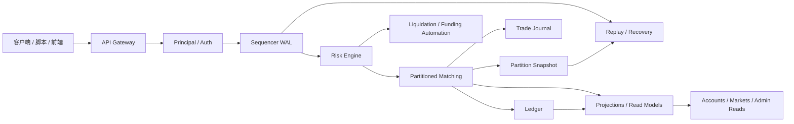
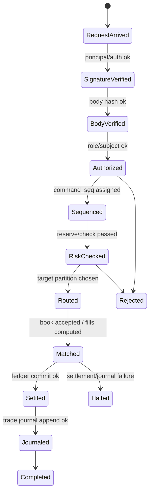
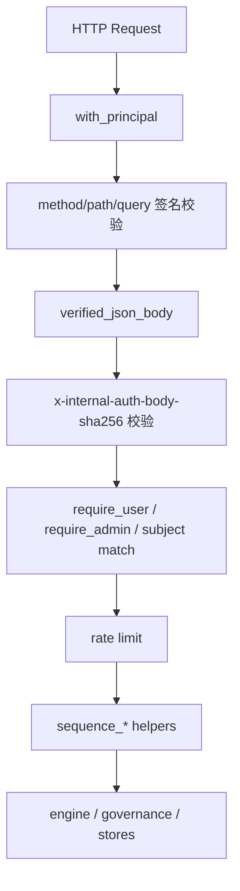
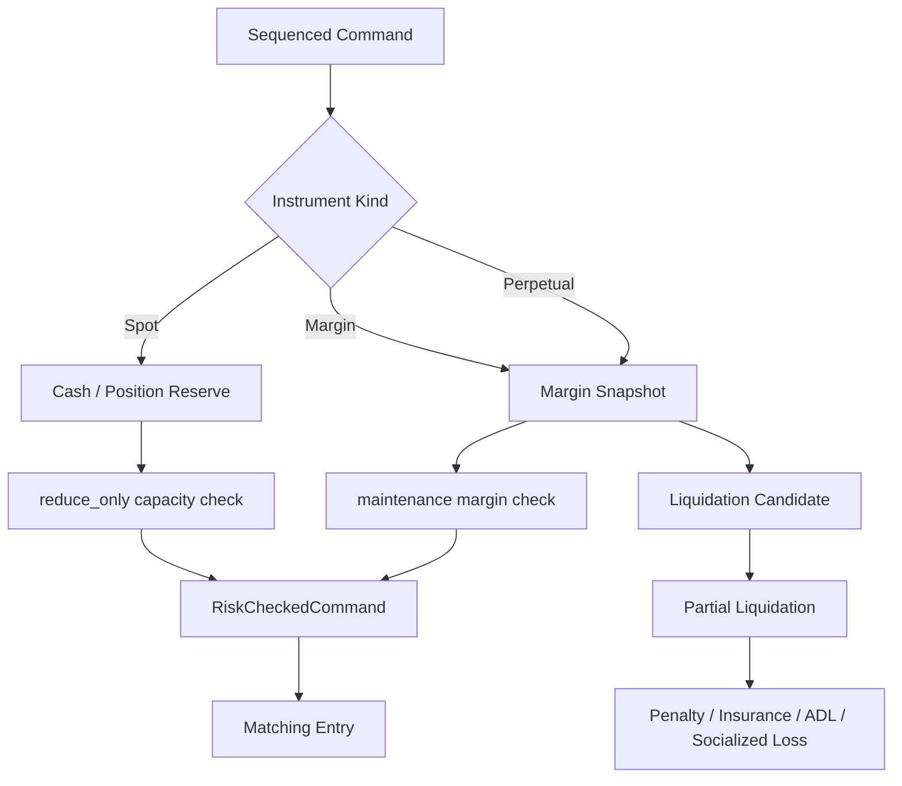
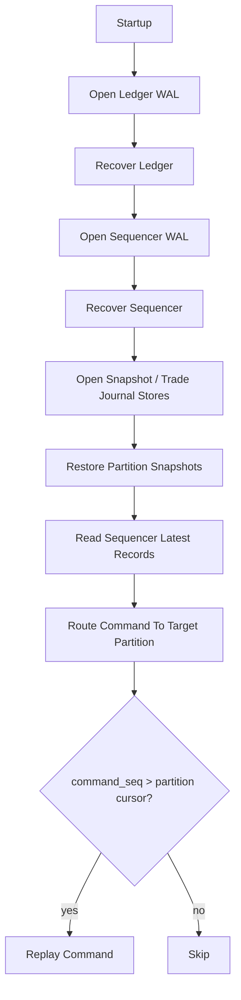
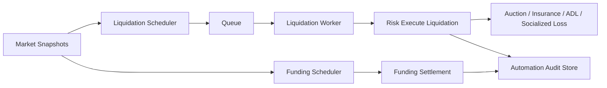

# Rust Exchange 中文架构图（Mermaid 版，2026-03-12）

## 1. 总体架构图

这张图对应当前真实运行主线：

- `API` 做入口、鉴权、限流、命令装配
- `Sequencer` 产生命令真相与顺序真相
- `Risk` 决定是否允许命令进入撮合/结算
- `Matching` 维护订单簿状态机与成交状态机
- `Ledger` 维护资金/仓位会计真相
- `Snapshot + Replay` 负责恢复一致性
- `Automation` 承担强平与 funding 批处理

---

## 2. 写请求状态机

说明：

- 并不是所有命令都会走到 `Journaled`
- 管理命令和撤单命令通常是更短路径
- 成交相关命令必须保证“失败不脏状态”

---

## 3. API / 安全架构图

当前安全边界已经绑定：

- method
- path
- query
- request_id
- body hash
- role / subject / session

这意味着当前控制面与交易面已经不是匿名 JSON API，而是完整签名保护下的内部接口模型。

---

## 4. 风控架构图

当前 `risk` 的真实职责已经包括：

- 预占/释放
- 保证金快照
- 强平判断
- 部分强平执行
- ADL 排名
- socialized loss 分摊

---

## 5. 撮合架构图

```mermaid
flowchart LR
    A[RiskCheckedCommand] --> B[Partition Router]
    B --> C[Partition Runtime]
    C --> D[MarketRuntime]
    D --> E[Price-Time Priority]
    E --> F[Self-Trade Prevention]
    F --> G[Price Band / Market State]
    G --> H[Match Outcome]
    H --> I[Ledger Settle]
    I --> J[Trade Journal]
    J --> K[Snapshot Cursor Advance]
```

关键点：

- `replace` 已是原子语义
- `self-trade prevention` 已默认拒绝隐式自成交
- `snapshot + replay` 是按 partition cursor 恢复，不是全局近似

---

## 6. 恢复架构图

这条路径是当前恢复正确性的核心，也是之前已修复的重要边界。

---

## 7. 自动化运行态架构图

所以当前系统已经不只是“下单撮合”，还包括自动化风险处理运行态。

---

## 8. 组件职责表

| 组件 | 当前职责 | 是否已接入主线 |
|---|---|---|
| `crates/api` | 鉴权、限流、命令装配、恢复启动、调度 | 是 |
| `crates/sequencer` | `command_seq`、生命周期、命令 WAL | 是 |
| `crates/risk` | 预占、校验、保证金、强平、ADL、funding | 是 |
| `crates/matching` | 分区撮合、订单簿、快照、replay | 是 |
| `crates/ledger` | 资金/仓位会计真相、`op_id` 去重 | 是 |
| `crates/projections` | positions / margin / pnl 读模型 | 是 |
| `crates/instruments` | instrument registry | 是 |
| `crates/persistence` | append-only WAL 抽象 | 是 |

---

## 9. 一句话结论

当前 `rust-exchange` 的架构已经可以用一句话概括：

**一个以 `sequencer + risk + partitioned matching + ledger + snapshot/replay` 为中心的 Rust 单主线交易核心，外层由 API 和自动化风控调度统一编排。**
