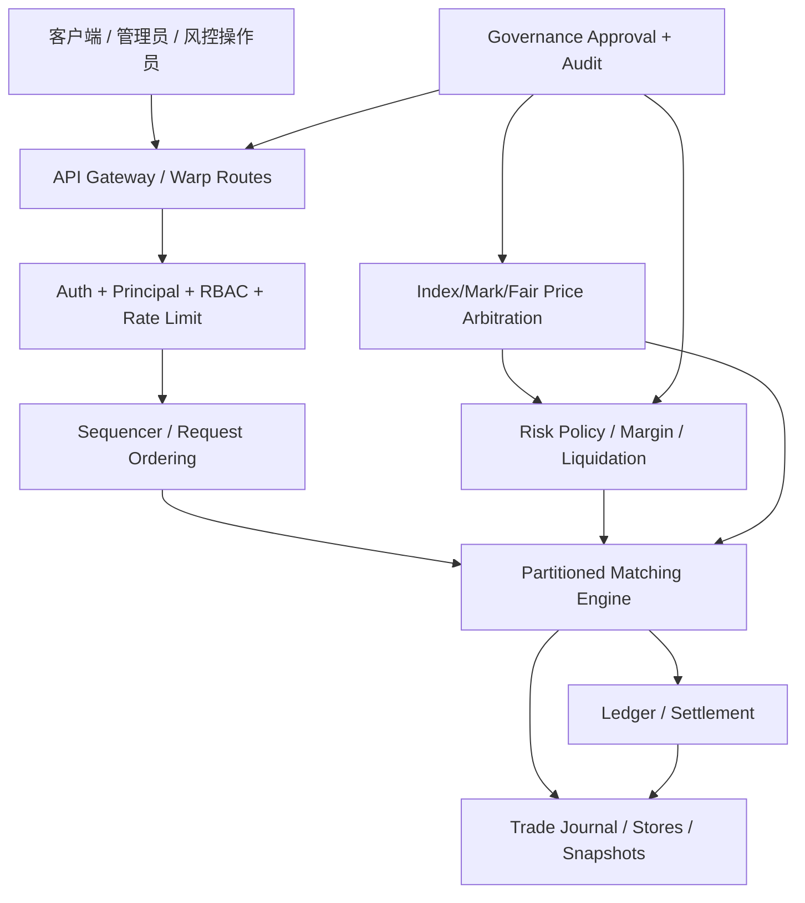
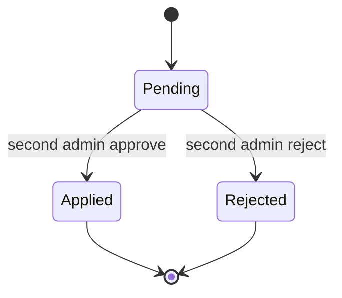

# Rust Exchange 中文架构总览（2026-03-12）

## 1. 目标与当前定位

本仓当前已经明确收敛为：**`rust-exchange` 是唯一正式交易真相（single source of truth）**。

这意味着：

- Rust 负责订单命令、风控预检查、撮合状态、账本结算、清算、治理审批、恢复边界。
- Go/旧实现只保留兼容层、对照实现、历史参考或外围服务，不再承载真实资金状态。
- 控制面与数据面开始分离：交易主路径强调确定性与可恢复性，治理/人工干预进入审批流和审计流。

当前这条主线已经从“能跑”推进到“基本正确、基本可控、具备治理雏形”，但仍未完全达到交易所级最终形态。尤其是：

- bankruptcy price 已从 proxy 往 fair/index/mark 复合模型推进，但还需要进一步精炼。
- liquidation 已具备队列、重试分层、拍卖、ADL、保险金、socialized loss 链路，但治理与执行模型仍可继续增强。
- 多源指数仲裁已补上 quorum / stale / outlier / degraded 逻辑，但还没有接真正外部控制面与更复杂的 source health scoring。

---

## 2. 总体分层

当前 Rust 主线可以分为 6 层：

1. **接入层 Gateway / API**
2. **认证鉴权与限流层**
3. **命令序列化与恢复层**
4. **交易核心层（matching / risk / ledger）**
5. **清算与风险治理层**
6. **控制面与审计层**

一个简化的总图如下：

---

## 3. 数据面主路径

### 3.1 交易写路径

当前写路径的目标形态是：

`client -> auth/validate -> sequencer -> matching -> ledger -> journal -> snapshot/replay`

结合当前实现，可理解为：

1. API 收到用户写请求。
2. 通过 `AuthenticatedPrincipal` 注入真实身份，不再信任 body 内的匿名 `user_id`/`actor_id`。
3. 网关执行基础校验：body 限制、角色限制、限流、请求 ID 规范化。
4. 命令进入 sequencer，拿到单调递增的 `command_seq`。
5. 根据 `market_id + outcome` 路由到分区撮合引擎。
6. 分区引擎执行订单簿状态转换与撮合。
7. 成交后进入账本结算和 trade journal 记录。
8. 快照与 WAL 为恢复提供边界。

### 3.2 当前订单相关核心语义

已明确或已落地的规则包括：

- `replace` 语义采用 **cancel + new 丢失优先级**。
- `replace` 已按原子语义修复：新单不合法时，不允许先吞掉旧单。
- 自成交防护默认是 **reject taker**，避免撮合中产生隐式副作用。
- snapshot + replay 已按 **分区游标** 判断，而不是全局最大 seq 近似。
- 成交失败路径已朝“先计算候选结果、后提交状态”收口，避免订单簿/账本半提交。

---

## 4. 模块职责划分

### 4.1 `crates/api`

职责：

- 对外 HTTP/WS 接口
- principal 注入、RBAC、body limit、timeout、CORS/Origin 收口
- 管理接口、风险控制接口、治理审批接口
- 指数价格写入/查询、fair price 视图
- 清算队列 worker 驱动

它现在既是外部 API 入口，也是控制面编排层。

### 4.2 `crates/matching`

职责：

- 订单簿状态机
- price-time priority
- 分区路由与分区内串行执行
- 撮合 fill 计算
- mass cancel / replace / snapshot restore 等交易状态转换

它的边界越来越清晰：

- **matching 负责“订单如何成交”**
- **risk 负责“订单/仓位/清算是否允许继续”**
- **ledger 负责“成交后资金和仓位如何结算”**

### 4.3 `crates/ledger`

职责：

- 现金变化
- 仓位变化
- 预占释放/结算后的资金记账
- 保持幂等/恢复边界下的一致账务结果

### 4.4 `crates/risk`

职责已经从“少量校验函数”向“前置风险状态机 + 清算治理引擎”演进：

- 保证金检查
- leverage / maintenance margin / buffer 规则
- liquidation 执行
- ADL 排队评分
- socialized loss / insurance fund 协调
- bankruptcy price / fair price / mark price 辅助计算
- funding 等风险相关结算

本轮又新增了：

- `execute_partial_liquidation_with_governance(...)`
- 支持部分清算数量，而不再只有全量强平

### 4.5 `crates/persistence` / WAL / snapshot

职责：

- 为命令、治理动作、价格写入、清算队列等状态变化提供持久化 append 能力
- 结合 snapshot 形成崩溃恢复边界
- 当前恢复逻辑的关键原则已经从“全局 seq”改成“按目标分区 seq 判断是否 replay”

---

## 5. 价格体系：Index / Mark / Fair Price

这是当前架构里变化最大的部分之一。

### 5.1 Index Price：多源仲裁

当前 `PersistentIndexPriceStore` 已不是简单单值表，而是：

- 按 `market_id + outcome + source` 存储来源价格
- 每个 source 有自己的 `recorded_at`
- 在读取时执行仲裁，而不是写入时覆盖唯一值

当前仲裁逻辑包括：

1. 收集某个市场的所有 source。
2. 根据 `stale_after_secs` 剔除过期源。
3. 取 active source 的中位数作为 baseline。
4. 用偏离阈值（bps）筛出 inlier。
5. 若 inlier 数量达到 quorum，则使用 inlier 集合的中位数。
6. 若 quorum 不满足，则进入 degraded mode，回退到 active source 集合的中位数。

因此当前已经具备：

- **source quorum**
- **source degradation**
- **stale source filtering**
- **outlier rejection**
- **degraded fallback**

### 5.2 Fair Price：多因子仲裁

当前 `fair_price_quote_for_snapshot(...)` 使用以下因子计算 fair price：

- arbitrated index price
- book mid price
- reference price
- last trade price

并通过权重聚合，然后做一次基于 index/reference 的夹逼（clamp）。

可理解为：

- index 是主要锚点
- 盘口和最近成交用来微调
- reference price 是补充锚点
- 最后限制 fair price 不偏离锚点过远

### 5.3 当前状态与后续方向

现在已经不是单一“手工 reference price”模型，而是：

- `index -> mark/fair -> liquidation/funding/adl`

但仍有后续空间：

- 真正的 source health score
- source 优先级权重动态调整
- index / mark / fair 的治理切换策略
- 极端行情下 circuit-breaker 与 price freeze policy

---

## 6. 清算链路：从单次强平到分层拍卖 + ADL

### 6.1 当前清算流程

当前清算主链路已接近交易所风控结构：

1. 风险模块判断用户保证金不足或达到清算条件。
2. 生成 liquidation queue item。
3. worker 周期性扫描 queue。
4. 根据 fair/mark/index 价格和 policy 生成拍卖上下文。
5. 接受/读取 liquidation auction bids。
6. 若拍卖成交不足，进入 retry tier。
7. 若仍不足，可能触发 ADL / insurance fund / socialized loss 分担。

### 6.2 已经具备的关键能力

当前已实现：

- liquidation queue store
- retry tier / retry backoff
- operator override
- insurance fund 协调
- socialized loss 基础策略
- ADL ranking 雏形
- bankruptcy proxy/fair 相关输出
- partial liquidation 执行
- 多轮 auction round

### 6.3 从“单赢家”升级为“阶梯式 liquidation ladder”

本轮最关键的一项升级是：

**liquidation 不再只选一个赢家 bid，而是支持按价格阶梯、按数量逐步吃单的 ladder 式撮合。**

这意味着：

- 拍卖簿中的多个有效 bid 可以在同一轮共同承担清算量。
- 每个 bid 可以部分成交。
- `remaining_position_qty` 会随着多笔 partial fills 累计下降。
- 某一轮没有完全清空时，可以进入下一轮，而不是简单地“一轮一赢家”。

所以当前 liquidation book 更像：

- 一个专门面向风险处置的拍卖订单簿
- 不是普通用户的现货盘口
- 但已经具备 book-like ladder 执行特征

### 6.4 还未到最终交易所形态的地方

虽然已经明显进步，但还不算最终版 liquidation engine：

- 还没有完全独立的 liquidation auction matching book crate
- 还没有真正的 price ladder 深度治理参数矩阵
- 还没有把 operator retry / override / cancel / re-open workflow 做成完整工作流系统
- 还没有实现更细粒度的 clearing waterfall tier governance

---

## 7. ADL / Insurance / Socialized Loss 治理链路

当前风险处置不是简单“爆仓即结束”，而是已经形成初步瀑布机制：

1. 尝试拍卖式 liquidation
2. 尝试部分清算 / 多轮清算
3. 使用保险金缓冲
4. 在治理规则允许下执行 ADL 候选排序
5. 仍不足时进入 socialized loss 分摊

### 7.1 ADL

当前 ADL 已有：

- 排序治理参数
- 候选数限制
- 社会化损失单候选上限
- 与 maintenance margin、杠杆、size、buffer 等要素关联的评分框架

但还未完全达到“最终交易所 ADL 治理模型”――仍可以继续增强：

- 实时 ADL queue 可视化与 explainability
- 更精细的 score 设计
- 不同产品线的独立 ADL policy
- 治理回放与审计可解释输出

### 7.2 Insurance Fund

保险基金目前已经进入风控链路，但更偏策略协调器角色，还不是完全独立资金金库系统。

### 7.3 Socialized Loss

当前已经有 socialized loss 路径与治理限制，但仍需要：

- 更完整的分摊层级与分组策略
- 更强的审计规则
- 触发阈值治理
- 更细粒度的操作员介入流程

---

## 8. 治理控制面：双人审批与审计收口

这是这轮补强后的另一条关键主线。

### 8.1 为什么要把敏感操作从“立即生效”改为“待审批”

交易系统里以下操作不应由单一管理员即时落地：

- ADL 参数变更
- liquidation policy 变更
- 人工 index price 写入
- liquidation queue override

原因很简单：

- 这些操作会直接改变风险处置、价格锚、清算结果或候选人命运。
- 单人即时生效容易引入误操作、权限滥用、价格操纵风险。

### 8.2 当前审批模型

现在新增了 `GovernanceActionRecord` 与 `PendingGovernanceActionStore`，形成：

- 创建待审批动作
- 管理员 B 审批或驳回
- 审批成功后才真正 apply
- 请求人和审批人必须不是同一人

简化状态机如下：

### 8.3 已接入双人审批的动作

目前已接入：

- `adl_governance_update`
- `liquidation_policy_update`
- `index_price_upsert`
- `liquidation_queue_override`

对应治理接口已经包含：

- 创建待审批动作
- 列出动作
- 审批动作
- 驳回动作

### 8.4 审计价值

这条链路的价值不只是“防止误操作”，更关键是：

- 所有敏感动作可追溯
- 谁请求、谁批准、何时生效都有记录
- 可以对操作行为做后验审计与责任归属

---

## 9. 认证、权限、限流、安全默认值

用户前面非常强调“安全收口”，当前架构已经明显向安全默认值靠拢：

- 默认本地监听，而不是默认公网暴露
- 写接口走 principal 注入，不再信任 body 的 `user_id`
- 管理接口要求 admin
- 提现、控制面、参考价、kill-switch 等都应落在受控权限之下
- IP 限流、用户级限流、管理接口更严格限流逐步接入
- WebSocket / CORS / Origin 逐步从开放模式收口到 allowlist 模式

这一部分是交易所系统“能否上生产”的基础前提之一。

---

## 10. 并发模型、线程与锁的真实边界

当前 Rust 主线在并发上遵循的核心思想是：

- **市场内状态尽量串行化处理**，避免订单簿并发写造成复杂锁竞争。
- **市场间/分区间并行**，通过 partition 把吞吐扩出去。
- **全局共享配置/持久化/索引/治理状态** 用并发 map/store 承载。

### 10.1 分区串行化

撮合引擎最关键的正确性来自：

- 同一分区内命令串行执行
- 通过 sequencer 提供单调序号
- 通过 inflight / queue depth 等指标监控负载

此前已修过一次 inflight 计数竞态问题，说明这块边界已经被关注并整改。

### 10.2 共享状态

当前 API / risk / governance 层大量使用持久化 store + 并发 map 的模式，优点是：

- 结构简单
- 易于追加审计记录
- 恢复逻辑更明确

需要长期注意的点是：

- 控制面状态增多后，要防止 `main.rs` 继续膨胀
- 需要逐步把 pricing / governance / liquidation orchestration 拆成更独立 crate
- 需要避免 API 层拿过多业务锁或同时协调多个共享对象导致时序耦合上升

### 10.3 当前评价

就“逻辑闭环和竞争合理性”而言，当前方案是：

- **正确性优先于极致性能**
- **串行化优先于乐观并发**
- **先保证不脏状态，再逐步扩吞吐**

这对于仍在快速演进的交易核心是合理路线。

---

## 11. 恢复模型：Snapshot + WAL + Partition Replay

当前恢复架构已经明确比之前更正确：

### 11.1 旧问题

过去如果用“所有分区里最大的 snapshot seq”作为 replay 起点，会导致：

- 快分区推进更快
- 慢分区尚未应用的命令被错误跳过
- 最终出现恢复后状态缺命令

### 11.2 当前修正后的原则

恢复必须基于：

- 每个分区自己的 `last_applied_command_seq`
- 每条 WAL 记录先按命令目标市场路由到分区
- 只对 **该分区尚未应用** 的 seq 执行 replay

这是正确的交易恢复边界。

---

## 12. 当前产品线能力边界

从架构设计上看，当前已经在往多产品统一风险底座推进，但仍不是所有产品都已业务完备。

### 12.1 相对更成熟的部分

- 现货/事件合约式撮合与订单簿
- 保证金/杠杆类风险参数骨架
- perpetual/funding/liquidation 方向的框架

### 12.2 仍在演进中的部分

- 真正交易所级 bankruptcy engine
- 更完整 perpetual 风险治理
- 交割/期权/OTC/理财产品线的一致读模型与清算治理模型
- 独立的 Position/PnL/Margin projections crate
- 外部价格源控制面与健康管理

所以当前更准确的说法不是“所有产品都完整实现”，而是：

- **底层架构已经开始统一**
- **风险与治理底座已经成形**
- **最终产品完备度仍需分阶段推进**

---

## 13. 当前真实架构的优点

### 13.1 已形成单一交易真相

这是最重要的优点：Rust 成为唯一真相后，很多双写、双语义、双恢复边界的问题都显著减少。

### 13.2 已从“撮合引擎”升级为“交易 + 风控 + 清算 + 治理”骨架

现在不是单一订单簿项目，而是一个初步交易所后端骨架。

### 13.3 敏感控制面已经开始审批化

这会明显降低人工参考价、人工 override、参数误配带来的系统性风险。

### 13.4 价格体系开始具备抗异常能力

多源仲裁 + stale/outlier 过滤 + degraded fallback，比单值写入稳健得多。

---

## 14. 当前仍需继续补强的地方

为了避免“文档看起来过于乐观”，这里明确列出还没有完成的部分。

### 14.1 价格仲裁仍可继续升级

- 动态权重
- source reliability score
- source failover policy
- 市场异常时的治理冻结策略

### 14.2 liquidation auction 还不是独立撮合子系统

- 现在已是 ladder 化，但仍主要在 API orchestration 中实现
- 后续应抽为更独立、可测试、可治理的拍卖引擎模块

### 14.3 风险读模型还不独立

- Position / PnL / Margin projections 应从 API 主文件与临时聚合逻辑中独立出来

### 14.4 控制面编排逻辑仍偏集中

- `crates/api/src/main.rs` 已承载过多 orchestration
- 长期应拆分 pricing / governance / liquidation / admin routes

### 14.5 交易所级治理仍需更多工作流

- operator override workflow
- 双人审批之外的分层权限
- 特殊事件应急治理
- 更细的审计规则与回放工具

---

## 15. 推荐的下一阶段拆分方向

建议下一阶段按以下方向继续演进：

1. 把 `pricing arbitration` 抽成独立 crate
2. 把 `liquidation auction book` 抽成独立 crate
3. 把 `governance workflow` 抽成独立 crate
4. 把 `position / pnl / margin projection` 抽成独立读模型 crate
5. 把 `admin control plane` 从交易 API 主文件中分离

这样可以把当前“单文件编排型架构”逐步转成“明确模块边界型架构”。

---

## 16. 一句话结论

截至 2026-03-12，`rust-exchange` 的真实架构已经不是简单撮合 demo，而是：

**一个以 Rust 为唯一真相、具备撮合、账本、风险、清算、价格仲裁、治理审批、恢复边界的交易系统骨架。**

它现在已经具备“基本正确、基本可控、可以继续向交易所级演进”的结构基础；但距离最终交易所级完成态，还需要继续把价格治理、清算拍卖、风险读模型、控制面拆分、治理工作流做深做透。
